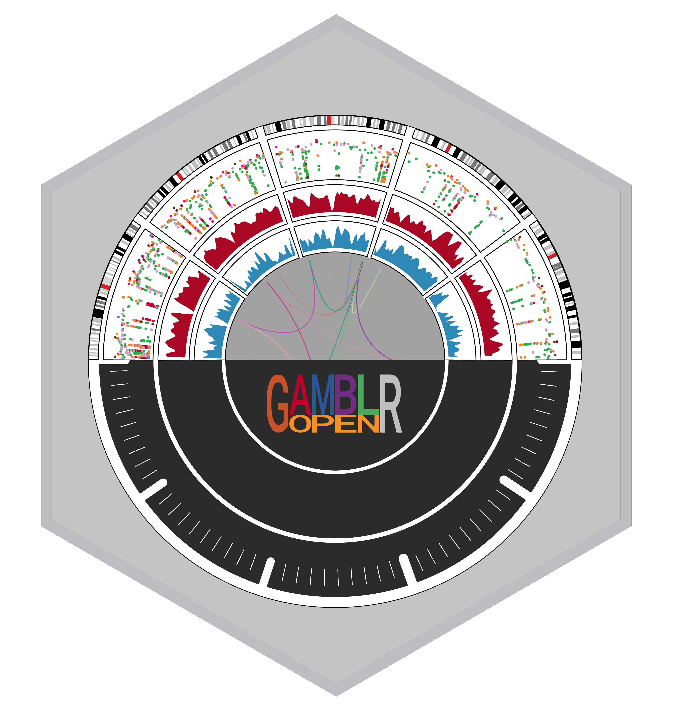

Hello GAMBLRs!

# GAMBLR.open

<p align="center" width="100%">
    
</p>

Database, mining, manipulation and convenience functions for working with genomic data of mature B-cell lymphomas. This package is a wrapper that provides a convenient one-stop access to load the following packages from the GAMBLR family:
* [GAMBLR.data](https://github.com/morinlab/GAMBLR.data) - collection of genomic
data for analysis of Mature B-cell neoplasms
* [GAMBLR.helpers](https://github.com/morinlab/GAMBLR.helpers) - a set of low-level functions for data operation
* [GAMBLR.utils](https://github.com/morinlab/GAMBLR.utils) - higher level set of functions to operate on genomic data
* [GAMBLR.viz](https://github.com/morinlab/GAMBLR.viz) - set of functions used mostly for visualizations
* [GAMBLR.predict](https://github.com/morinlab/GAMBLR.predict) - collection of functions and helpers to classify B-cell lymphomas

# Cloning repo for the code development

The easiest way to obtain and contribute to GAMBLR.open is to do this via cloning the repository

```
cd
git clone git@github.com:morinlab/GAMBLR.open.git
```

In your R editor of choice, set your working directory to the place you just cloned the repo.

```
setwd("~/GAMBLR.open")
```

Install the package in R by running the following command (requires the devtools package)

```
devtools::install()
```

As GAMBL users (GAMBLRs, so to speak) rely on the functionality of this package, the Master branch is protected. All commits must be submitted via pull request on a branch.
