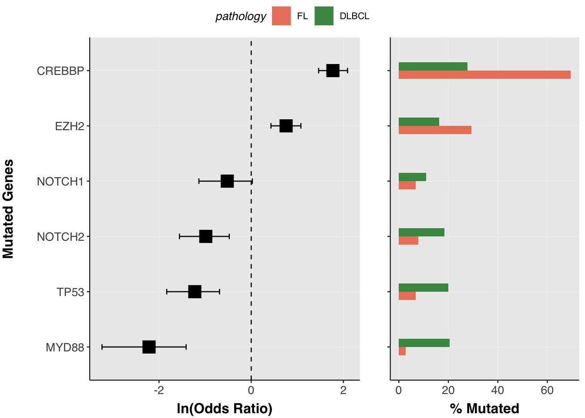
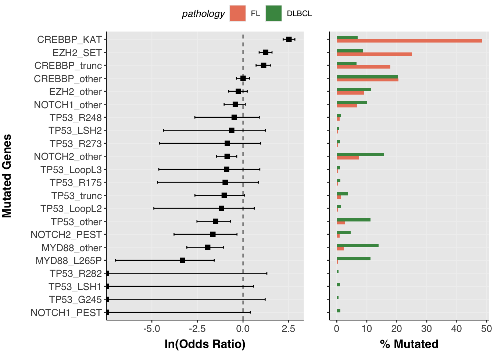
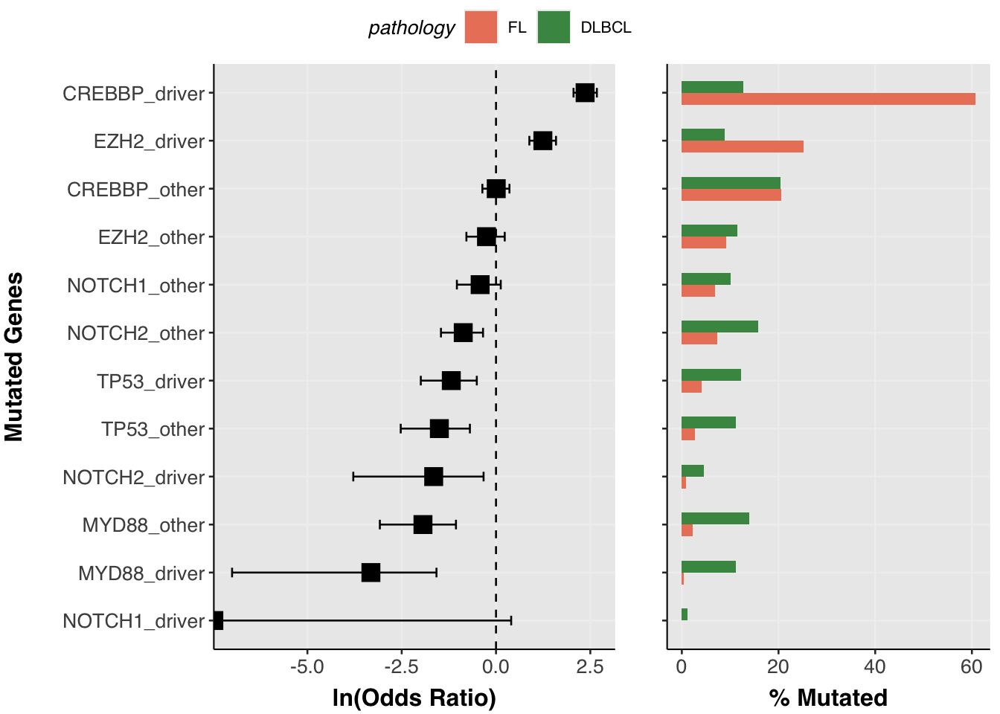
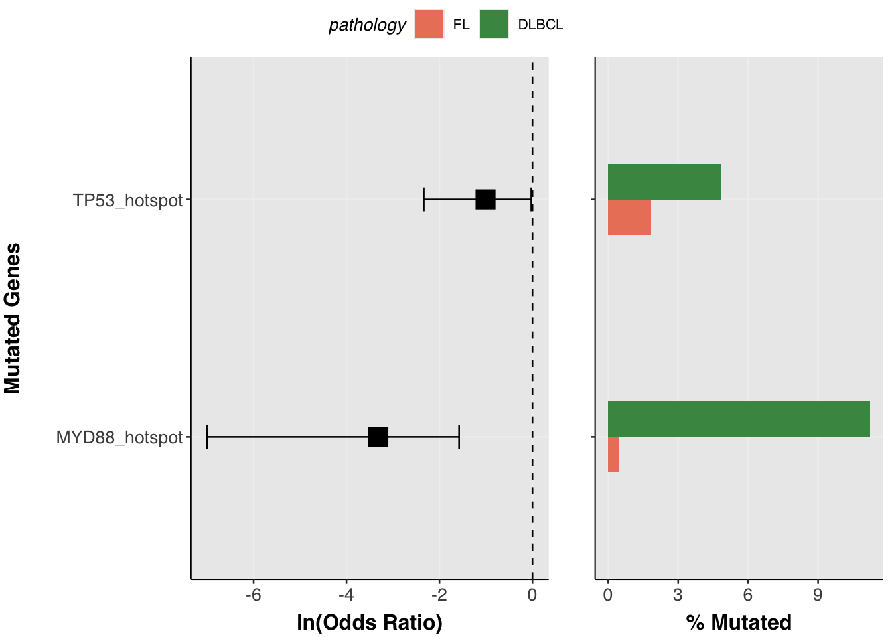
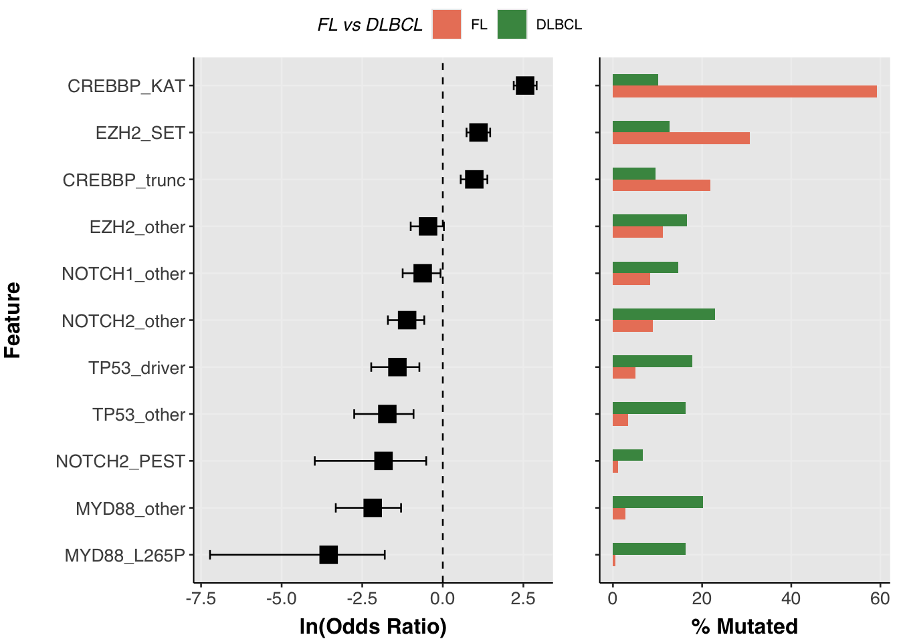
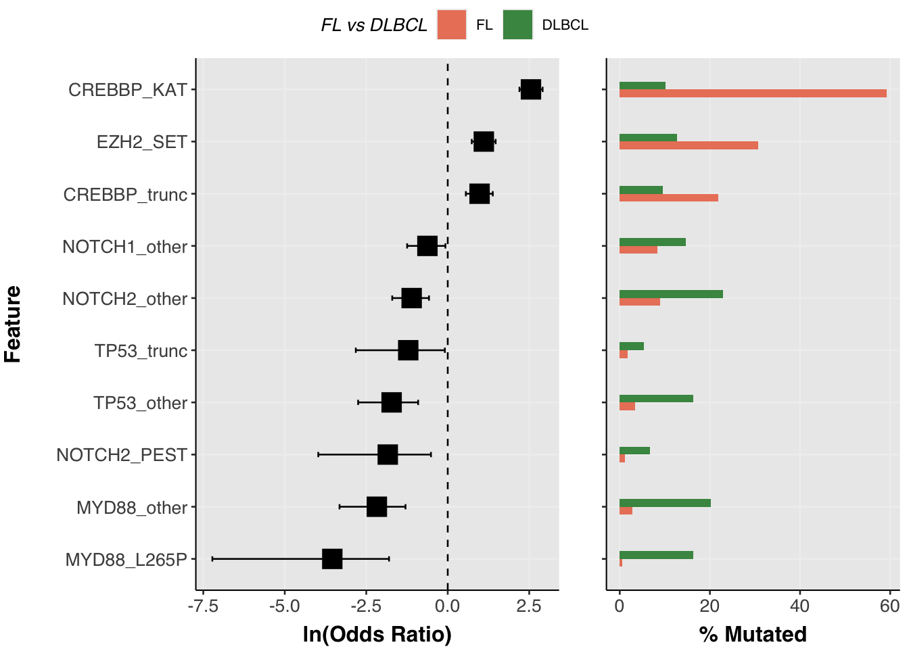

# Driver mutations and hot spots

## Tutorial: driver mutations and hot spots

In the [previous
tutorial](https://morinlab.github.io/GAMBLR.open/articles/feature_matrix.md)
we assembled a binary feature matrix using
[`assemble_genetic_features()`](https://rdrr.io/pkg/GAMBLR.utils/man/assemble_genetic_features.html).
That approach treats each gene as a single binary feature: a sample is
either mutated or not. For many analyses that is exactly what you want —
but for some genes the *type* of mutation matters as much as its
presence and you will want to separately handle mutations of different
varieties or with certain functional annotations.

Consider *TP53*: a truncating mutation, a DNA-contact hotspot
substitution (e.g. R248W), and a structural-domain mutation (e.g. Loop
L3) all hit the same gene but have different biological consequences and
could different frequencies across lymphoma subtypes. Similarly,
*CREBBP* KAT domain missense mutations have a function distinct from
truncating mutations. The canonical *MYD88* hotspot is enriched in a
different LymphGen class than other MYD88 missense mutations. What other
nuances could we be missing?

This tutorial shows how to use
[`annotate_curated_drivers()`](https://rdrr.io/pkg/GAMBLR.utils/man/annotate_curated_drivers.html)
from GAMBLR.utils to add sub-gene categories to your MAF, and how to use
those categories for visualisation and statistical comparison with the
companion functions
[`prettyForestPlot()`](https://morinlab.github.io/GAMBLR.viz/reference/prettyForestPlot.html)
(GAMBLR.viz),
[`test_feature_associations()`](https://rdrr.io/pkg/GAMBLR.utils/man/test_feature_associations.html)
(GAMBLR.utils), and
[`plot_feature_associations()`](https://morinlab.github.io/GAMBLR.viz/reference/plot_feature_associations.html)
(GAMBLR.viz).

``` r
library(GAMBLR.open)
library(GAMBLR.utils)
library(GAMBLR.viz)
library(tidyverse)
```

### Obtain metadata and mutations

We will compare FL and DLBCL samples across a set of recurrently mutated
genes.

``` r
metadata <- get_gambl_metadata() %>%
    filter(pathology %in% c("FL", "DLBCL")) %>%
    GAMBLR.helpers::check_and_clean_metadata(duplicate_action = "keep_first")
```

``` r
maf <- get_all_coding_ssm(metadata)
```

### Annotate with driver categories

[`annotate_curated_drivers()`](https://rdrr.io/pkg/GAMBLR.utils/man/annotate_curated_drivers.html)
appends four new columns to every row of the MAF for the genes you
specify:

| Column | What it contains |
|----|----|
| `hot_spot` | logical; TRUE for curated hotspot mutations |
| `hotspot_alias` | the specific hotspot name (e.g. `EZH2_Y641`), NA otherwise |
| `mutation_alias` | finest-resolution label: named hotspot, structural region, or broad class (e.g. `TP53_trunc`, `TP53_R248`) |
| `driver_alias` | two-category label per gene: `<GENE>_driver` or `<GENE>_other` |

``` r
genes <- c("EZH2", "CREBBP", "TP53", "MYD88", "NOTCH1", "NOTCH2")

maf <- annotate_curated_drivers(
    maf_data        = maf,
    genes_of_interest = genes
)
```

Let’s look at what was added for TP53:

``` r
maf %>%
    filter(Hugo_Symbol == "TP53") %>%
    select(Tumor_Sample_Barcode, Variant_Classification,
           HGVSp_Short, hot_spot, mutation_alias, driver_alias) %>%
    head(20)
```

    genomic_data Object
    Genome Build: grch37
    Showing first 10 rows:
       Tumor_Sample_Barcode Variant_Classification HGVSp_Short hot_spot
    1           DLBCL10456T      Missense_Mutation     p.R282W     TRUE
    2           DLBCL10460T      Missense_Mutation     p.Y126D    FALSE
    3           DLBCL10462T      Nonsense_Mutation     p.R196*    FALSE
    4           DLBCL10466T      Missense_Mutation     p.V216M    FALSE
    5           DLBCL10475T      Missense_Mutation     p.E258D    FALSE
    6           DLBCL10477T      Nonsense_Mutation     p.R209*    FALSE
    7           DLBCL10478T      Missense_Mutation     p.Y220C    FALSE
    8           DLBCL10479T      Nonsense_Mutation     p.Q136*    FALSE
    9           DLBCL10488T                 Intron        <NA>    FALSE
    10          DLBCL10490T      Missense_Mutation     p.P151H    FALSE
       mutation_alias driver_alias
    1       TP53_R282  TP53_driver
    2       TP53_LSH1  TP53_driver
    3      TP53_trunc  TP53_driver
    4      TP53_other   TP53_other
    5      TP53_other   TP53_other
    6      TP53_trunc  TP53_driver
    7      TP53_other   TP53_other
    8      TP53_trunc  TP53_driver
    9      TP53_other   TP53_other
    10     TP53_other   TP53_other

And a quick frequency count of the alias categories:

``` r
maf %>%
    filter(Hugo_Symbol == "TP53") %>%
    count(mutation_alias, sort = TRUE)
```

    genomic_data Object
    Genome Build: grch37
    Showing first 10 rows:
       mutation_alias   n
    1      TP53_other 351
    2      TP53_trunc  98
    3       TP53_R248  43
    4     TP53_LoopL2  39
    5     TP53_LoopL3  34
    6       TP53_R175  33
    7       TP53_LSH1  31
    8       TP53_R273  30
    9       TP53_LSH2  24
    10      TP53_G245  16

TP53 driver mutations are dominated by truncations (`TP53_trunc`)
alongside a handful of specific structural-domain and hotspot
categories. Note that `hotspot_alias` is NA for truncating mutations,
because truncations are not counted as hotspots in the curated list —
this distinction matters when choosing how to group features for
analysis (see below).

### Visualising associations with prettyForestPlot

[`prettyForestPlot()`](https://morinlab.github.io/GAMBLR.viz/reference/prettyForestPlot.html)
now accepts a `maf_column` argument that controls the granularity of the
features shown. Compare the three levels:

#### Hugo_Symbol — one bar per gene (baseline)

``` r
prettyForestPlot(
    maf              = maf,
    metadata         = metadata,
    comparison_column = "pathology",
    comparison_values = c("FL", "DLBCL"),
    genes            = genes,
    maf_column       = "Hugo_Symbol"
)$arranged
```



#### mutation_alias — finest resolution

Each curated region or hotspot codon becomes its own feature, revealing
heterogeneity within a gene. Here TP53 splits into truncation, hotspot
codon, and structural-loop categories; EZH2_Y641 stands apart from other
EZH2 mutations.

``` r
prettyForestPlot(
    maf              = maf,
    metadata         = metadata,
    comparison_column = "pathology",
    comparison_values = c("FL", "DLBCL"),
    genes            = genes,
    maf_column       = "mutation_alias"
)$arranged
```



This level of granularity is useful for discovery, but it comes at a
cost: splitting mutations into many fine-grained categories means each
category is supported by fewer samples. Rare categories may not be
testable at all, and the multiple-testing burden grows with the number
of features. If your goal is to ask whether a gene is differentially
mutated between groups — rather than which specific mutation class
drives the difference — a coarser grouping is usually more powerful and
easier to interpret. The next two levels of `maf_column` offer that
tradeoff.

#### driver_alias — binary driver classification

Collapses to just two categories per gene (`<GENE>_driver` vs
`<GENE>_other`), useful when you only want to distinguish curated driver
events from background mutations without further sub-classification.

``` r
prettyForestPlot(
    maf              = maf,
    metadata         = metadata,
    comparison_column = "pathology",
    comparison_values = c("FL", "DLBCL"),
    genes            = genes,
    maf_column       = "driver_alias"
)$arranged
```



#### hotspot_alias — strictly recurrent hotspot codons only

Only the most recurrent named hotspot codons appear here. Truncating
mutations and broad LOF regions do not generate a `hotspot_alias` entry.
For TP53, whose driver biology is dominated by truncations, very few
rows appear — the per-gene fallback mechanism in
[`test_feature_associations()`](https://rdrr.io/pkg/GAMBLR.utils/man/test_feature_associations.html)
below handles this case automatically.

``` r
prettyForestPlot(
    maf              = maf,
    metadata         = metadata,
    comparison_column = "pathology",
    comparison_values = c("FL", "DLBCL"),
    genes            = genes,
    maf_column       = "hotspot_alias"
)$arranged
```



### Statistical testing with test_feature_associations

[`prettyForestPlot()`](https://morinlab.github.io/GAMBLR.viz/reference/prettyForestPlot.html)
computes statistics internally but does not expose them.
[`test_feature_associations()`](https://rdrr.io/pkg/GAMBLR.utils/man/test_feature_associations.html)
performs the same per-feature Fisher’s exact test and returns a tidy
tibble you can inspect, filter, or feed directly into
[`plot_feature_associations()`](https://morinlab.github.io/GAMBLR.viz/reference/plot_feature_associations.html).

``` r
results <- test_feature_associations(
    maf              = maf,
    metadata         = metadata,
    comparison_column = "pathology",
    comparison_values = c("FL", "DLBCL"),
    genes            = genes,
    maf_column       = "mutation_alias"
)

results %>% arrange(q_value)
```

    # A tibble: 22 × 13
       gene   feature    used_fallback      OR conf_low conf_high  p_value n_mutated
       <chr>  <chr>      <lgl>           <dbl>    <dbl>     <dbl>    <dbl>     <int>
     1 CREBBP CREBBP_KAT FALSE         12.8    9.03        18.4   1.15e-48       263
     2 MYD88  MYD88_L26… FALSE          0.0290 0.000730     0.165 5.87e-12       253
     3 MYD88  MYD88_oth… FALSE          0.114  0.0361       0.274 4.25e-11       318
     4 EZH2   EZH2_SET   FALSE          3.03   2.09         4.35  4.57e- 9       253
     5 TP53   TP53_other FALSE          0.179  0.0640       0.403 2.14e- 7       258
     6 CREBBP CREBBP_tr… FALSE          2.66   1.74         3.99  4.91e- 6       186
     7 NOTCH2 NOTCH2_ot… FALSE          0.331  0.182        0.563 4.81e- 6       371
     8 NOTCH2 NOTCH2_PE… FALSE          0.159  0.0188       0.598 1.36e- 3       105
     9 NOTCH1 NOTCH1_ot… FALSE          0.536  0.288        0.932 2.24e- 2       241
    10 TP53   TP53_trunc FALSE          0.298  0.0595       0.916 2.86e- 2        87
    # ℹ 12 more rows
    # ℹ 5 more variables: n_mutated_FL <int>, n_total_FL <int>,
    #   n_mutated_DLBCL <int>, n_total_DLBCL <int>, q_value <dbl>

The output contains odds ratios, confidence intervals, p-values, and
Benjamini–Hochberg-adjusted q-values. The `n_mutated_<group>` and
`n_total_<group>` columns carry per-group counts and effective
denominators (only samples present in both the MAF and the metadata by
default; set `restrict_to_maf = FALSE` to include all metadata samples).

#### Per-gene fallback for sparse features

Some genes have no testable `hotspot_alias` entries (e.g. TP53, which is
mutated mainly through truncations that don’t receive a hotspot alias).
The `fallback_column` parameter handles this gracefully: when a gene has
no features meeting `min_samples` under `maf_column`, it retests that
gene using `fallback_column` instead.

``` r
results_fb <- test_feature_associations(
    maf              = maf,
    metadata         = metadata,
    comparison_column = "pathology",
    comparison_values = c("FL", "DLBCL"),
    genes            = genes,
    maf_column       = "hotspot_alias",
    fallback_column  = "mutation_alias",
    verbose          = TRUE
)

# which genes used the fallback?
results_fb %>% filter(used_fallback)
```

    # A tibble: 9 × 13
      gene   feature      used_fallback     OR conf_low conf_high  p_value n_mutated
      <chr>  <chr>        <lgl>          <dbl>    <dbl>     <dbl>    <dbl>     <int>
    1 EZH2   EZH2_other   TRUE           0.633   0.369      1.03  6.71e- 2       277
    2 EZH2   EZH2_SET     TRUE           3.03    2.09       4.35  4.57e- 9       253
    3 CREBBP CREBBP_KAT   TRUE          12.8     9.03      18.4   1.15e-48       263
    4 CREBBP CREBBP_other TRUE           0.798   0.547      1.15  2.25e- 1       504
    5 CREBBP CREBBP_trunc TRUE           2.66    1.74       3.99  4.91e- 6       186
    6 NOTCH1 NOTCH1_other TRUE           0.536   0.288      0.932 2.24e- 2       241
    7 NOTCH1 NOTCH1_PEST  TRUE           0       0          1.26  1.04e- 1        27
    8 NOTCH2 NOTCH2_PEST  TRUE           0.159   0.0188     0.598 1.36e- 3       105
    9 NOTCH2 NOTCH2_other TRUE           0.331   0.182      0.563 4.81e- 6       371
    # ℹ 5 more variables: n_mutated_FL <int>, n_total_FL <int>,
    #   n_mutated_DLBCL <int>, n_total_DLBCL <int>, q_value <dbl>

#### Manually controlling which genes use fine-grained features

The automatic fallback triggers when a gene has no testable entries
under `maf_column`. But you may want to force the fallback for a
specific gene regardless — for example, you may decide that TP53’s
truncation-dominated mutation spectrum is not meaningfully split by
`mutation_alias` in your cohort and you’d prefer it to be represented by
`driver_alias` categories instead, while keeping the fine-grained
`mutation_alias` resolution for all other genes.

The simplest way to achieve this is to set `mutation_alias` to `NA` for
the genes you want to exempt before calling
[`test_feature_associations()`](https://rdrr.io/pkg/GAMBLR.utils/man/test_feature_associations.html).
The fallback mechanism will then take over for those genes
automatically.

``` r
maf_custom <- maf %>%
    mutate(mutation_alias = ifelse(Hugo_Symbol == "TP53", NA, mutation_alias))

results_custom <- test_feature_associations(
    maf              = maf_custom,
    metadata         = metadata,
    comparison_column = "pathology",
    comparison_values = c("FL", "DLBCL"),
    genes            = genes,
    maf_column       = "mutation_alias",
    fallback_column  = "driver_alias",
    verbose          = TRUE
)

# confirm TP53 fell back and others did not
results_custom %>%
    distinct(gene, used_fallback) %>%
    arrange(gene)
```

    # A tibble: 6 × 2
      gene   used_fallback
      <chr>  <lgl>
    1 CREBBP FALSE
    2 EZH2   FALSE
    3 MYD88  FALSE
    4 NOTCH1 FALSE
    5 NOTCH2 FALSE
    6 TP53   TRUE         

``` r
plot_feature_associations(
    results         = results_custom,
    max_q           = 0.1,
    comparison_name = "FL vs DLBCL"
)$arranged
```



This pattern generalises to any set of genes: just `NA` out
`mutation_alias` (or whichever `maf_column` you are using) for the genes
you want treated more coarsely, and let `fallback_column` handle them.

### Plotting test results with plot_feature_associations

The results tibble feeds directly into
[`plot_feature_associations()`](https://morinlab.github.io/GAMBLR.viz/reference/plot_feature_associations.html).
Group sizes are carried in the `n_total_*` columns so no additional
arguments are needed for the bar plot.

``` r
plots <- plot_feature_associations(
    results         = results,
    max_q           = 0.1,
    comparison_name = "FL vs DLBCL"
)

plots$arranged
```



You can filter to the most significant features and inspect the
underlying data before plotting:

``` r
plots$results %>%
    select(gene, feature, OR, conf_low, conf_high, q_value,
           starts_with("n_mutated_"), starts_with("n_total_"))
```

    # A tibble: 10 × 10
       gene   feature           OR conf_low conf_high  q_value n_mutated_FL
       <chr>  <fct>          <dbl>    <dbl>     <dbl>    <dbl>        <int>
     1 EZH2   EZH2_SET      3.03   2.09         4.35  2.51e- 8           55
     2 CREBBP CREBBP_KAT   12.8    9.03        18.4   2.52e-47          106
     3 CREBBP CREBBP_trunc  2.66   1.74         3.99  1.54e- 5           39
     4 TP53   TP53_trunc    0.298  0.0595       0.916 6.30e- 2            3
     5 TP53   TP53_other    0.179  0.0640       0.403 9.40e- 7            6
     6 MYD88  MYD88_L265P   0.0290 0.000730     0.165 6.46e-11            1
     7 MYD88  MYD88_other   0.114  0.0361       0.274 3.12e-10            5
     8 NOTCH1 NOTCH1_other  0.536  0.288        0.932 5.46e- 2           15
     9 NOTCH2 NOTCH2_PEST   0.159  0.0188       0.598 3.74e- 3            2
    10 NOTCH2 NOTCH2_other  0.331  0.182        0.563 1.54e- 5           16
    # ℹ 3 more variables: n_mutated_DLBCL <int>, n_total_FL <int>,
    #   n_total_DLBCL <int>

*Happy GAMBLing!*

      /$$$$$$     /$$$$$$    /$$      /$$   /$$$$$$$    /$$        .:::::::
     /$$__  $$   /$$__  $$  | $$$    /$$$  | $$__  $$  | $$        .::    .::
    | $$  \__/  | $$  \ $$  | $$$$  /$$$$  | $$  \ $$  | $$        .::    .::
    | $$ /$$$$  | $$$$$$$$  | $$ $$/$$ $$  | $$$$$$$   | $$   <-   .: .::
    | $$|_  $$  | $$__  $$  | $$  $$$| $$  | $$__  $$  | $$        .::  .::
    | $$  \ $$  | $$  | $$  | $$\  $ | $$  | $$  \ $$  | $$        .::    .::
    |  $$$$$$/  | $$  | $$  | $$ \/  | $$  | $$$$$$$/  | $$$$$$$$  .::      .::
     \______/   |__/  |__/  |__/     |__/  |_______/   |________/
     ~GENOMIC~~~~~~~~~~~~~OF~~~~~~~~~~~~~~~~~B-CELL~~~~~~~~~~~~~~~~~~IN~~~~~~
     ~~~~~~~~~~~~ANALYSIS~~~~~~MATURE~~~~~~~~~~~~~~~~~~~LYMPHOMAS~~~~~~~~~~R~
