# Exploring simple somatic mutations

``` r
library(GAMBLR.open)
suppressMessages(library(tidyverse))
```

In general, the experimental data available through GAMBLR.open is
obtained using one of the `get_` [family of
functions](https://morinlab.github.io/GAMBLR.open/reference/index.html#get-functions).
These require that you specify which samples you want data from, which
you accomplish by providing a metadata table that has been subset to
just the samples you require. The metadata for the full set of samples
available in `GAMBLR.data` can be obtained using `get_gambl_metadata`.
You can subset this table using
[`dplyr::filter`](https://dplyr.tidyverse.org/reference/filter.html).
Here, we’ll focus on all DLBCL and FL samples. In many of the examples
for GAMBLR.open and other packages in the GAMBLR family you will see
`check_and_clean_metadata`. This is currently required due to the
existence of near duplicate rows in the metadata. These duplicated rows
exist because some samples were part of more than one study and each row
refers to one of those studies. A call to `check_and_clean_metadata` as
in this example will remove the duplicated rows, which ensures your
analyses will not include duplicated data.

``` r
my_meta <- get_gambl_metadata(seq_type_filter = c("genome","capture")) %>%
  dplyr::filter(
    pathology %in% c("FL", "DLBCL")
  ) 
#How many rows for each pathology and seq_type?
group_by(my_meta, seq_type, pathology) %>% 
  count() %>% kableExtra::kable(format="html")
```

| seq_type | pathology |    n |
|:---------|:----------|-----:|
| capture  | DLBCL     | 1783 |
| genome   | DLBCL     |  534 |
| genome   | FL        |  219 |

``` r
my_meta = check_and_clean_metadata(my_meta,duplicate_action = "keep_first")

#How many rows remain?
group_by(my_meta, seq_type, pathology) %>% 
  count() %>% kableExtra::kable(format="html")
```

| seq_type | pathology |    n |
|:---------|:----------|-----:|
| capture  | DLBCL     | 1783 |
| genome   | DLBCL     |  529 |
| genome   | FL        |  219 |

``` r
length(unique(my_meta$sample_id))
```

    [1] 2531

``` r
nrow(my_meta)
```

    [1] 2531

This shows that the rows in our metadata represent unique samples so we
can proceed. Retrieving simple somatic mutations (SSMs) in a MAF-like
format can be done a variety of ways. If your analysis is focusing on
protein-coding alterations, then `get_coding_ssm` should meet your
needs.

``` r
# retrieve MAF for all exome (capture) samples
capture_coding <- get_coding_ssm(
  these_samples_metadata = my_meta,
  projection = "grch37",
  include_silent = TRUE,
  this_seq_type = "capture"
)

nrow(capture_coding)
```

    [1] 29515

``` r
# retrieve MAF for all genome samples
genome_coding <- get_coding_ssm(
  these_samples_metadata = my_meta,
  projection = "grch37",
  include_silent = TRUE,
  this_seq_type = "genome"
)

num_genome_coding_rows = nrow(genome_coding)
genome_coding_sample = unique(genome_coding$Tumor_Sample_Barcode)
num_genome_coding_sample = length(genome_coding_sample)
```

A total of 10971 mutations in coding regions from 588 samples were
retrieved with `get_coding_ssm`.

To access additional mutations in non-coding regions, you can use
`get_ssm_by_samples` if you desire all available mutations or
`get_ssm_by_regions` if you want more control over which regions the
mutations correspond to.

> **Note**
>
> `GAMBLR.data`, and therefore `GAMBLR.open` does not contain
> genome-wide mutations from very many samples due to data sharing
> restrictions. Instead, for most samples the only non-coding mutations
> included are those within the regions commonly affected by aberrant
> somatic hypermutation (aSHM).

``` r
#retrieve genome-wide mutations for all genomes
genome_all = get_ssm_by_samples(these_samples_metadata = my_meta,
                                this_seq_type="genome")

num_genome_all_rows = nrow(genome_all)
genome_all_sample = unique(genome_all$Tumor_Sample_Barcode)
num_genome_all_sample = length(genome_all_sample)
```

A total of 270867 genome-wide mutations from 594 samples were retrieved
with `get_ssm_by_samples`.

These two approaches give us mutations from a different number of
samples. We can delve into this a bit by focusing on the differences.

``` r
genome_all_only = genome_all_sample[!genome_all_sample %in% genome_coding_sample]
g_u = length(genome_all_only)
```

There are 6 sample_id that have mutations in the genome-wide result but
not in coding space.

``` r
filter(my_meta, sample_id %in% genome_all_only) %>% 
    dplyr::select(sample_id,cohort,pairing_status, pathology, patient_id, study) %>%
    kableExtra::kable(format="html")
```

| sample_id | cohort | pairing_status | pathology | patient_id | study |
|:---|:---|:---|:---|:---|:---|
| 05-24561T | DLBCL_Marra | matched | DLBCL | 05-24561 | FL_Dreval |
| 14-13938T | FL_GenomeCanada | matched | FL | 14-13938 | FL_Dreval |
| 14-33798_tumorA | DLBCL_LSARP_Trios | matched | DLBCL | 14-33798 | DLBCL_Hilton |
| FL2004T1 | FL_Kridel | matched | FL | 06-25647 | FL_Dreval |
| HTMCP-01-07-00336-01A-01E | DLBCL_HTMCP | matched | DLBCL | HTMCP-01-07-00336 | DLBCL_Thomas |
| SP59300 | DLBCL_ICGC | matched | DLBCL | DO27777 | FL_Dreval |

Since the non-coding mutations we get from `get_ssm_by_samples` are
restricted to known B-cell lymphoma genes and regions affected by aSHM,
we should be able to obtain most of these with a call to
[get_ssm_by_regions](https://morinlab.github.io/GAMBLR.open/reference/get_ssm_by_regions.md)
as long as the regions we request include all aSHM sites.

``` r
ashm_genome_maf = get_ssm_by_regions(these_samples_metadata = my_meta,
                              this_seq_type = "genome",
                              streamlined = F)
coding_counted = group_by(genome_coding,Tumor_Sample_Barcode) %>%
  summarise(coding=n())
ashm_counted = group_by(ashm_genome_maf,Tumor_Sample_Barcode) %>%
    summarise(ashm=n())

genome_all_counted = group_by(genome_all,Tumor_Sample_Barcode) %>%
    summarise(all=n())

count_compare = left_join(genome_all_counted,ashm_counted)
count_compare = left_join(count_compare,coding_counted) %>%
  arrange(desc(all))

count_compare = left_join(count_compare,
                          select(my_meta,Tumor_Sample_Barcode,cohort))

count_compare %>% kableExtra::kable(format="html")
```

| Tumor_Sample_Barcode      |   all | ashm | coding | cohort             |
|:--------------------------|------:|-----:|-------:|:-------------------|
| SU-DHL-4                  | 32824 |  156 |    363 | DLBCL_cell_lines   |
| OCI-Ly3                   | 31532 |  117 |    353 | DLBCL_cell_lines   |
| OCI-Ly10                  | 30051 |  126 |    376 | DLBCL_cell_lines   |
| SU-DHL-10                 | 26855 |   57 |    290 | DLBCL_cell_lines   |
| DOHH-2                    | 22089 |   48 |    234 | DLBCL_cell_lines   |
| HTMCP-01-06-00206-01A-01D |  2832 |  194 |     73 | DLBCL_HTMCP        |
| HTMCP-01-06-00105-01A-01D |  2511 |   97 |     65 | DLBCL_HTMCP        |
| SP192997                  |  1901 |   87 |     49 | DLBCL_ICGC         |
| SP116697                  |  1576 |  419 |     94 | DLBCL_ICGC         |
| 13-26835_tumorA           |  1145 |  698 |    120 | DLBCL_LSARP_Trios  |
| 01-16433_tumorB           |  1051 |   92 |     36 | DLBCL_LSARP_Trios  |
| SP193546                  |   985 |  657 |     49 | DLBCL_ICGC         |
| 16-16192T                 |   926 |  351 |     46 | DLBCL_GenomeCanada |
| HTMCP-01-06-00611-01A-01D |   806 |  512 |     86 | DLBCL_HTMCP        |
| 13-38657_tumorB           |   767 |  489 |     77 | DLBCL_LSARP_Trios  |
| SP193375                  |   733 |  381 |     24 | DLBCL_ICGC         |
| 13-38657_tumorA           |   720 |  458 |     67 | DLBCL_LSARP_Trios  |
| FL1019T1                  |   712 |  524 |     45 | FL_Kridel          |
| 10-31625T                 |   694 |  219 |     27 | DLBCL_GenomeCanada |
| HTMCP-01-06-00594-01A-01D |   694 |  409 |    102 | DLBCL_HTMCP        |
| 09-37629T                 |   692 |  260 |     42 | DLBCL_GenomeCanada |
| 06-11677_tumorA           |   688 |  420 |     61 | DLBCL_LSARP_Trios  |
| 00-14595_tumorC           |   679 |  348 |     50 | DLBCL_LSARP_Trios  |
| 00-14595_tumorD           |   679 |  367 |     40 | DLBCL_LSARP_Trios  |
| 07-35482T                 |   678 |   54 |     13 | DLBCL_Marra        |
| 13-26835_tumorD           |   668 |  331 |     67 | DLBCL_LSARP_Trios  |
| SP116668                  |   666 |  194 |     46 | DLBCL_ICGC         |
| HTMCP-01-10-00160-01A-01D |   643 |  185 |     35 | DLBCL_HTMCP        |
| SP116670                  |   639 |  414 |     70 | DLBCL_ICGC         |
| 13-26835_tumorB           |   614 |  320 |     61 | DLBCL_LSARP_Trios  |
| SP124969                  |   591 |  344 |     44 | DLBCL_ICGC         |
| SP59304                   |   582 |  208 |     39 | DLBCL_ICGC         |
| HTMCP-01-06-00146-01A-01D |   580 |  236 |     30 | DLBCL_HTMCP        |
| HTMCP-01-06-00175-01A-01D |   577 |  285 |     34 | DLBCL_HTMCP        |
| SP116676                  |   571 |  258 |     30 | DLBCL_ICGC         |
| HTMCP-01-15-00370-01A-01E |   559 |  144 |     27 | DLBCL_HTMCP        |
| 17-40409_tumorB           |   557 |  252 |     31 | DLBCL_LSARP_Trios  |
| 17-40409_tumorA           |   555 |  252 |     30 | DLBCL_LSARP_Trios  |
| 16-11636T                 |   554 |  257 |     56 | DLBCL_GenomeCanada |
| HTMCP-01-06-00306-01A-01D |   546 |  329 |     59 | DLBCL_HTMCP        |
| SP59452                   |   539 |  295 |     38 | DLBCL_ICGC         |
| SP59448                   |   525 |  236 |     30 | DLBCL_ICGC         |
| 02-28397_tumorA           |   524 |  296 |     41 | DLBCL_LSARP_Trios  |
| SP59368                   |   509 |  275 |     25 | DLBCL_ICGC         |
| 14-25466T                 |   490 |  203 |     40 | DLBCL_GenomeCanada |
| 11-13204_tumorB           |   488 |  107 |     38 | DLBCL_LSARP_Trios  |
| 11-13204_tumorA           |   475 |  107 |     27 | DLBCL_LSARP_Trios  |
| 03-23488_tumorA           |   467 |  258 |     35 | DLBCL_LSARP_Trios  |
| HTMCP-01-06-00497-01A-01D |   467 |  208 |     21 | DLBCL_HTMCP        |
| SP116610                  |   461 |  270 |     31 | DLBCL_ICGC         |
| 09-12737T                 |   456 |  207 |     12 | DLBCL_Marra        |
| SP192993                  |   455 |  246 |     26 | DLBCL_ICGC         |
| HTMCP-01-20-00272-01A-01E |   453 |  175 |     15 | DLBCL_HTMCP        |
| 03-33266_tumorB           |   450 |  281 |     47 | DLBCL_LSARP_Trios  |
| 07-41887_tumorA           |   441 |  271 |     39 | DLBCL_LSARP_Trios  |
| 16-23208T                 |   439 |  206 |     22 | DLBCL_GenomeCanada |
| 13-30451T                 |   437 |  180 |     24 | DLBCL_GenomeCanada |
| 16-18029T                 |   437 |  210 |     59 | DLBCL_GenomeCanada |
| FL1019T2                  |   437 |  289 |     30 | FL_Kridel          |
| 99-27137T                 |   429 |  121 |     19 | DLBCL_Marra        |
| 14-35026T                 |   428 |  104 |     23 | DLBCL_GenomeCanada |
| 06-14634T                 |   417 |  169 |     12 | DLBCL_Marra        |
| 11-21727T                 |   415 |  122 |     23 | DLBCL_Gascoyne     |
| 05-15635_tumorA           |   414 |  234 |     52 | DLBCL_LSARP_Trios  |
| 14-41461T                 |   411 |  227 |     25 | DLBCL_GenomeCanada |
| 15-16885T                 |   404 |  184 |     20 | FL_GenomeCanada    |
| SP192765                  |   403 |  206 |     37 | DLBCL_ICGC         |
| HTMCP-01-06-00307-01A-01D |   400 |  119 |     26 | DLBCL_HTMCP        |
| 13-40370T                 |   394 |  231 |     22 | FL_GenomeCanada    |
| 15-21654T                 |   392 |  191 |     18 | DLBCL_GenomeCanada |
| 05-17793T                 |   391 |  127 |     29 | DLBCL_Gascoyne     |
| 07-41887_tumorB           |   391 |  228 |     35 | DLBCL_LSARP_Trios  |
| FL3020T1                  |   389 |  182 |     25 | FL_Kridel          |
| HTMCP-01-06-00634-01A-01D |   389 |  201 |     43 | DLBCL_HTMCP        |
| 09-16981T                 |   387 |   80 |     29 | DLBCL_Gascoyne     |
| FL1003T2                  |   386 |   94 |     11 | FL_Kridel          |
| 09-15842_tumorB           |   382 |  148 |     27 | DLBCL_LSARP_Trios  |
| POG707T                   |   382 |  173 |     16 | POG                |
| 14-32442T                 |   378 |  215 |     32 | DLBCL_GenomeCanada |
| SP193816                  |   377 |  255 |     33 | FL_ICGC            |
| 07-32561_tumorB           |   375 |   93 |     21 | DLBCL_LSARP_Trios  |
| 01-14774_tumorA           |   374 |  138 |     33 | DLBCL_LSARP_Trios  |
| 09-31008_tumorA           |   373 |  226 |     30 | DLBCL_LSARP_Trios  |
| 07-31833T                 |   369 |  184 |     31 | DLBCL_Gascoyne     |
| 14-27873T                 |   369 |  206 |     46 | DLBCL_GenomeCanada |
| 06-11677_tumorB           |   365 |  238 |     22 | DLBCL_LSARP_Trios  |
| HTMCP-01-15-00366-01A-01E |   365 |  209 |     32 | DLBCL_HTMCP        |
| 08-17645_tumorB           |   364 |  196 |     35 | DLBCL_LSARP_Trios  |
| LY_RELY_128_tumorA        |   363 |  181 |     28 | DLBCL_LSARP_Trios  |
| 09-15842_tumorA           |   361 |  145 |     25 | DLBCL_LSARP_Trios  |
| SP193967                  |   361 |  192 |     35 | DLBCL_ICGC         |
| 16-27074_tumorB           |   357 |  135 |     24 | DLBCL_LSARP_Trios  |
| 09-12864T                 |   354 |   75 |     20 | DLBCL_Gascoyne     |
| 16-27074_tumorA           |   353 |  133 |     23 | DLBCL_LSARP_Trios  |
| SP116690                  |   352 |  109 |     21 | DLBCL_ICGC         |
| 16-16723T                 |   350 |  130 |     20 | DLBCL_GenomeCanada |
| SP193229                  |   349 |  190 |     13 | FL_ICGC            |
| SP192970                  |   348 |  119 |     19 | DLBCL_ICGC         |
| 15-43657T                 |   346 |  130 |     22 | DLBCL_GenomeCanada |
| 09-31601_tumorA           |   342 |  149 |     21 | DLBCL_LSARP_Trios  |
| 15-11617T                 |   338 |  110 |     28 | DLBCL_GenomeCanada |
| 15-36675T                 |   337 |  170 |     35 | FL_GenomeCanada    |
| SP124975                  |   335 |  218 |     43 | DLBCL_ICGC         |
| 10-36955_tumorA           |   333 |   62 |     23 | DLBCL_LSARP_Trios  |
| 10-36955_tumorB           |   332 |   58 |     19 | DLBCL_LSARP_Trios  |
| 09-31008_tumorB           |   329 |  209 |     24 | DLBCL_LSARP_Trios  |
| SP193934                  |   329 |  109 |     18 | DLBCL_ICGC         |
| HTMCP-01-06-00036-01E     |   327 |  174 |     36 | DLBCL_HTMCP        |
| HTMCP-01-06-00136-01A-01D |   327 |  181 |     23 | DLBCL_HTMCP        |
| HTMCP-01-06-00563-01A-01D |   326 |  189 |     30 | DLBCL_HTMCP        |
| 03-23488_tumorB           |   318 |  171 |     27 | DLBCL_LSARP_Trios  |
| 09-33003_tumorB           |   318 |  124 |     32 | DLBCL_LSARP_Trios  |
| 14-37722T                 |   317 |  145 |     28 | DLBCL_GenomeCanada |
| HTMCP-01-06-00253-01A-01D |   317 |  206 |     28 | DLBCL_HTMCP        |
| SP124957                  |   317 |  181 |     23 | DLBCL_ICGC         |
| 04-24937T                 |   313 |  160 |     30 | DLBCL_GenomeCanada |
| 09-21480T                 |   311 |  107 |     14 | DLBCL_Gascoyne     |
| 16-32248_tumorB           |   311 |  114 |     22 | DLBCL_LSARP_Trios  |
| 08-17645_tumorA           |   309 |  186 |     28 | DLBCL_LSARP_Trios  |
| 19-16466_tumorA           |   306 |  165 |     14 | DLBCL_LSARP_Trios  |
| FL1003T1                  |   306 |   69 |     10 | FL_Kridel          |
| SP124979                  |   306 |  127 |     15 | FL_ICGC            |
| 06-23907T                 |   305 |   55 |     11 | DLBCL_Marra        |
| 15-41277T                 |   304 |  162 |     24 | FL_GenomeCanada    |
| HTMCP-01-10-00778-01A-01D |   304 |  181 |     30 | DLBCL_HTMCP        |
| SP193025                  |   302 |  137 |     15 | DLBCL_ICGC         |
| SP192815                  |   300 |  115 |     19 | DLBCL_ICGC         |
| 09-31601_tumorB           |   298 |   84 |     24 | DLBCL_LSARP_Trios  |
| FL1010T2                  |   297 |  118 |     27 | FL_Kridel          |
| HTMCP-01-06-00314-01A-01D |   295 |   65 |     16 | DLBCL_HTMCP        |
| SP124971                  |   294 |  101 |     19 | DLBCL_ICGC         |
| SP192856                  |   294 |   81 |     31 | DLBCL_ICGC         |
| SP192988                  |   291 |  163 |     17 | FL_ICGC            |
| 03-33266_tumorA           |   289 |  121 |     16 | DLBCL_LSARP_Trios  |
| 05-21634T                 |   289 |  139 |     25 | DLBCL_Gascoyne     |
| 10-39294_tumorB           |   288 |   74 |     25 | DLBCL_LSARP_Trios  |
| FL3011T1                  |   285 |  155 |     19 | FL_Kridel          |
| SP116645                  |   285 |  121 |     24 | FL_ICGC            |
| LY_RELY_128_tumorB        |   284 |  125 |     17 | DLBCL_LSARP_Trios  |
| 17-36275T                 |   283 |   81 |     20 | DLBCL_GenomeCanada |
| 06-19919T                 |   282 |   98 |      9 | DLBCL_Marra        |
| FL1002T2                  |   280 |  125 |     18 | FL_Kridel          |
| 09-41082T                 |   278 |   75 |      2 | DLBCL_Marra        |
| 02-15745_tumorB           |   276 |   86 |      7 | DLBCL_LSARP_Trios  |
| 05-18426T                 |   276 |  119 |     15 | DLBCL_Gascoyne     |
| SP116659                  |   276 |  124 |     11 | DLBCL_ICGC         |
| SP192767                  |   276 |   69 |     21 | DLBCL_ICGC         |
| SP116657                  |   274 |   59 |     19 | DLBCL_ICGC         |
| 05-15635_tumorB           |   272 |  124 |     15 | DLBCL_LSARP_Trios  |
| FL2002T1                  |   270 |  168 |     26 | FL_Kridel          |
| LY_RELY_028_tumorB        |   270 |  142 |     27 | DLBCL_LSARP_Trios  |
| 01-14774_tumorB           |   267 |   83 |     21 | DLBCL_LSARP_Trios  |
| SP193420                  |   267 |  191 |     11 | DLBCL_ICGC         |
| 14-20552_tumorB           |   266 |  132 |     27 | DLBCL_LSARP_Trios  |
| 15-38154T                 |   266 |   69 |     15 | DLBCL_GenomeCanada |
| 15-26538T                 |   263 |   52 |     16 | DLBCL_GenomeCanada |
| HTMCP-01-06-00185-01A-01D |   262 |  120 |     25 | DLBCL_HTMCP        |
| SP116683                  |   262 |  138 |      7 | FL_ICGC            |
| 02-15745_tumorD           |   261 |   66 |     21 | DLBCL_LSARP_Trios  |
| 10-39294_tumorA           |   260 |   60 |     20 | DLBCL_LSARP_Trios  |
| 18-19313_tumorB           |   259 |  122 |     23 | DLBCL_LSARP_Trios  |
| 15-31924T                 |   257 |   85 |     28 | DLBCL_GenomeCanada |
| SP59400                   |   256 |   77 |     16 | DLBCL_ICGC         |
| 08-29440_tumorB           |   255 |  127 |     28 | DLBCL_LSARP_Trios  |
| 18-19313_tumorA           |   254 |  120 |     23 | DLBCL_LSARP_Trios  |
| 95-32141_tumorA           |   254 |   84 |     22 | DLBCL_LSARP_Trios  |
| SP59348                   |   254 |  154 |     16 | FL_ICGC            |
| 08-15460T                 |   253 |  127 |     40 | DLBCL_Gascoyne     |
| HTMCP-01-06-00242-01A-01D |   252 |  147 |     30 | DLBCL_HTMCP        |
| SP116648                  |   252 |   59 |     18 | DLBCL_ICGC         |
| SP193766                  |   252 |  112 |     16 | MALY_Other_ICGC    |
| 08-15460_tumorB           |   251 |  125 |     20 | DLBCL_LSARP_Trios  |
| 14-35632T                 |   251 |   99 |     15 | DLBCL_GenomeCanada |
| 02-15745_tumorC           |   248 |   71 |     20 | DLBCL_LSARP_Trios  |
| SP59456                   |   248 |  133 |     26 | DLBCL_ICGC         |
| 17-36275_tumorB           |   243 |   65 |     11 | DLBCL_LSARP_Trios  |
| SP192882                  |   242 |   75 |     17 | FL_ICGC            |
| SP124959                  |   241 |  108 |      9 | DLBCL_ICGC         |
| SP192811                  |   241 |  141 |     15 | FL_ICGC            |
| 08-29440_tumorA           |   240 |  130 |     28 | DLBCL_LSARP_Trios  |
| 15-34472T                 |   240 |   77 |     23 | DLBCL_GenomeCanada |
| 97-18502_tumorB           |   240 |   53 |     15 | DLBCL_LSARP_Trios  |
| FL1018T2                  |   240 |  146 |     15 | FL_Kridel          |
| SP192800                  |   239 |  107 |     17 | DLBCL_ICGC         |
| SP194228                  |   238 |  129 |     13 | DLBCL_ICGC         |
| 16-43741_tumorA           |   237 |  120 |     18 | DLBCL_LSARP_Trios  |
| FL1002T1                  |   237 |  101 |     13 | FL_Kridel          |
| LY_RELY_116_tumorA        |   237 |   90 |     20 | DLBCL_LSARP_Trios  |
| 06-24255_tumorD           |   236 |  103 |     23 | DLBCL_LSARP_Trios  |
| 06-15256T                 |   235 |  100 |      7 | DLBCL_Marra        |
| 15-30123T                 |   235 |   71 |     14 | FL_GenomeCanada    |
| 16-27413T                 |   235 |  120 |     17 | DLBCL_GenomeCanada |
| SP116663                  |   235 |   77 |     18 | DLBCL_ICGC         |
| 10-36955_tumorD           |   234 |   62 |     17 | DLBCL_LSARP_Trios  |
| 14-24534_tumorB           |   234 |   56 |     16 | DLBCL_LSARP_Trios  |
| 09-33003T                 |   232 |   71 |     38 | DLBCL_Marra        |
| 14-20962T                 |   232 |  114 |     14 | DLBCL_GenomeCanada |
| 04-38964T                 |   230 |   97 |     16 | FL_GenomeCanada    |
| SP124973                  |   229 |  117 |     18 | DLBCL_ICGC         |
| 05-32947T                 |   227 |   20 |      8 | DLBCL_Marra        |
| HTMCP-01-06-00299-01A-01D |   227 |  123 |     18 | DLBCL_HTMCP        |
| SP59412                   |   226 |   58 |     13 | DLBCL_ICGC         |
| SP193005                  |   225 |   87 |     17 | DLBCL_ICGC         |
| FL1020T1                  |   224 |   96 |     33 | FL_Kridel          |
| SP193512                  |   224 |   94 |     17 | DLBCL_ICGC         |
| FL1011T1                  |   223 |   26 |      9 | FL_Kridel          |
| SP194195                  |   223 |  124 |     24 | DLBCL_ICGC         |
| 02-24492_tumorA           |   222 |  127 |     17 | DLBCL_LSARP_Trios  |
| 07-40648_tumorA           |   219 |   81 |     21 | DLBCL_LSARP_Trios  |
| FL1018T1                  |   218 |  140 |     14 | FL_Kridel          |
| FL3003T1                  |   216 |   71 |     14 | FL_Kridel          |
| SP193725                  |   215 |   88 |     21 | DLBCL_ICGC         |
| SP194143                  |   215 |   77 |     11 | DLBCL_ICGC         |
| 99-13280T                 |   214 |   46 |     23 | DLBCL_Gascoyne     |
| FL1020T2                  |   214 |   94 |     31 | FL_Kridel          |
| SP116649                  |   214 |   14 |      8 | FL_ICGC            |
| 15-18916T                 |   213 |   91 |     19 | FL_GenomeCanada    |
| HTMCP-01-16-00265-01A-01E |   212 |  125 |     18 | DLBCL_HTMCP        |
| 14-33436T                 |   211 |  114 |     17 | DLBCL_GenomeCanada |
| HTMCP-01-01-00451-01A-01D |   211 |   66 |     20 | DLBCL_HTMCP        |
| 15-24306T                 |   210 |   91 |     18 | DLBCL_GenomeCanada |
| 00-15201_tumorA           |   208 |   83 |     18 | DLBCL_LSARP_Trios  |
| 07-40648_tumorB           |   207 |   85 |     22 | DLBCL_LSARP_Trios  |
| 05-25674T                 |   206 |   90 |      7 | DLBCL_Marra        |
| 10-10826T                 |   204 |  110 |      9 | DLBCL_GenomeCanada |
| SP193976                  |   203 |   96 |     29 | DLBCL_ICGC         |
| HTMCP-01-06-00443-01A-01D |   202 |   58 |     17 | DLBCL_HTMCP        |
| SP193017                  |   202 |   28 |     13 | FL_ICGC            |
| 08-19764T                 |   201 |   51 |     10 | DLBCL_Gascoyne     |
| 92-38267_tumorB           |   201 |   76 |     24 | DLBCL_LSARP_Trios  |
| SP116706                  |   201 |   81 |     21 | FL_ICGC            |
| 06-24255_tumorC           |   196 |   89 |     16 | DLBCL_LSARP_Trios  |
| 04-14093_tumorB           |   195 |   38 |      6 | DLBCL_LSARP_Trios  |
| FL1017T2                  |   195 |   82 |     25 | FL_Kridel          |
| 04-14093_tumorA           |   193 |   36 |      6 | DLBCL_LSARP_Trios  |
| 04-21856_tumorB           |   193 |   95 |     19 | DLBCL_LSARP_Trios  |
| 11-34915T                 |   193 |  128 |     14 | FL_GenomeCanada    |
| 15-13383_tumorB           |   193 |   88 |     13 | DLBCL_LSARP_Trios  |
| 14-20552_tumorA           |   192 |   94 |     22 | DLBCL_LSARP_Trios  |
| 14-38639T                 |   192 |  123 |     22 | FL_GenomeCanada    |
| 15-43891T                 |   192 |   87 |     15 | DLBCL_GenomeCanada |
| 95-32141_tumorB           |   192 |   68 |     16 | DLBCL_LSARP_Trios  |
| SP116726                  |   191 |   59 |     17 | DLBCL_ICGC         |
| SP192833                  |   191 |   55 |      8 | DLBCL_ICGC         |
| 06-30025T                 |   190 |   35 |     11 | DLBCL_Marra        |
| 10-36955_tumorC           |   190 |   58 |     13 | DLBCL_LSARP_Trios  |
| 01-16433_tumorC           |   189 |   82 |     14 | DLBCL_LSARP_Trios  |
| 14-29443_tumorB           |   189 |   47 |     11 | DLBCL_LSARP_Trios  |
| FL1004T2                  |   189 |   68 |     22 | FL_Kridel          |
| HTMCP-01-06-00419-01B-01D |   189 |  107 |     19 | DLBCL_HTMCP        |
| 13-26601T                 |   187 |   46 |     10 | DLBCL_GenomeCanada |
| 14-29443_tumorA           |   187 |   60 |      8 | DLBCL_LSARP_Trios  |
| FL1004T1                  |   186 |   80 |     23 | FL_Kridel          |
| 16-20119T                 |   184 |  122 |     17 | FL_GenomeCanada    |
| 11-35935T                 |   183 |   42 |      5 | DLBCL_GenomeCanada |
| 17-45529_tumorB           |   183 |   30 |     16 | DLBCL_LSARP_Trios  |
| SP59352                   |   183 |   71 |     14 | FL_ICGC            |
| 96-11779T                 |   182 |   69 |     13 | FL_GenomeCanada    |
| FL3001T1                  |   180 |   82 |      9 | FL_Kridel          |
| 17-23504T                 |   179 |   70 |     12 | DLBCL_GenomeCanada |
| 15-39521T                 |   178 |   96 |     18 | FL_GenomeCanada    |
| 02-28397_tumorB           |   177 |   56 |     13 | DLBCL_LSARP_Trios  |
| 04-21856_tumorA           |   177 |   87 |     16 | DLBCL_LSARP_Trios  |
| 14-11427T                 |   177 |   71 |     22 | FL_GenomeCanada    |
| SP192798                  |   177 |   73 |     12 | DLBCL_ICGC         |
| 06-22057T                 |   176 |   50 |      5 | DLBCL_Marra        |
| 13-34919T                 |   176 |   37 |      7 | FL_GenomeCanada    |
| 14-23891T                 |   176 |   45 |     15 | DLBCL_GenomeCanada |
| SP116686                  |   176 |   94 |      6 | MALY_Other_ICGC    |
| SP124977                  |   176 |   54 |     16 | DLBCL_ICGC         |
| 15-15757T                 |   175 |   54 |     18 | DLBCL_GenomeCanada |
| FL1007T2                  |   175 |   54 |     13 | FL_Kridel          |
| 07-25012T                 |   172 |   48 |     13 | DLBCL_Marra        |
| SP193910                  |   172 |   81 |     13 | FL_ICGC            |
| 13-27960T                 |   171 |  115 |     19 | FL_GenomeCanada    |
| 16-13732T                 |   170 |   40 |      6 | DLBCL_GenomeCanada |
| FL1006T2                  |   169 |   78 |     14 | FL_Kridel          |
| SP116701                  |   169 |   50 |      9 | DLBCL_ICGC         |
| SP59460                   |   168 |   54 |     15 | DLBCL_ICGC         |
| 04-24061_tumorB           |   163 |   16 |     11 | DLBCL_LSARP_Trios  |
| 89-62169T                 |   163 |   87 |     15 | DLBCL_Gascoyne     |
| FL1016T2                  |   163 |   76 |     15 | FL_Kridel          |
| SP116718                  |   163 |   71 |      8 | FL_ICGC            |
| 07-25994_tumorB           |   162 |   90 |     20 | DLBCL_LSARP_Trios  |
| FL3013T1                  |   162 |   80 |      4 | FL_Kridel          |
| SP192850                  |   161 |   39 |     14 | DLBCL_ICGC         |
| 07-25994_tumorC           |   160 |   88 |     21 | DLBCL_LSARP_Trios  |
| 17-45529_tumorA           |   160 |   26 |     13 | DLBCL_LSARP_Trios  |
| SP116630                  |   160 |   47 |     14 | DLBCL_ICGC         |
| SP116606                  |   159 |   58 |      5 | FL_ICGC            |
| FL1010T1                  |   158 |   58 |      8 | FL_Kridel          |
| SP193258                  |   158 |   80 |     16 | FL_ICGC            |
| 12-32967T                 |   157 |   87 |      9 | FL_GenomeCanada    |
| SP193543                  |   157 |   48 |     13 | FL_ICGC            |
| FL3009T1                  |   156 |   81 |      9 | FL_Kridel          |
| 15-13383T                 |   154 |   75 |     28 | DLBCL_GenomeCanada |
| 15-36416T                 |   154 |   67 |     14 | FL_GenomeCanada    |
| 15-33862T                 |   153 |   66 |     20 | FL_GenomeCanada    |
| SP192940                  |   153 |   33 |     17 | DLBCL_ICGC         |
| 94-15772_tumorA           |   152 |   43 |      6 | DLBCL_LSARP_Trios  |
| SP59312                   |   152 |   42 |     10 | DLBCL_ICGC         |
| 02-13135T                 |   150 |   49 |     11 | DLBCL_Gascoyne     |
| 19-13976_tumorA           |   150 |   48 |      3 | DLBCL_LSARP_Trios  |
| 19-13976_tumorB           |   150 |   48 |      3 | DLBCL_LSARP_Trios  |
| 96-31596T                 |   150 |   67 |     11 | DLBCL_GenomeCanada |
| SP116674                  |   150 |   76 |     14 | FL_ICGC            |
| FL3008T1                  |   149 |   78 |     15 | FL_Kridel          |
| FL3014T1                  |   148 |   58 |      9 | FL_Kridel          |
| 13-26597T                 |   147 |   35 |      7 | FL_GenomeCanada    |
| 14-34508T                 |   147 |   80 |     16 | FL_GenomeCanada    |
| HTMCP-01-06-00310-01B-01D |   147 |   59 |     17 | DLBCL_HTMCP        |
| SP193326                  |   147 |   47 |     14 | FL_ICGC            |
| 16-10805T                 |   146 |   78 |     14 | FL_GenomeCanada    |
| SP124963                  |   146 |   93 |     14 | FL_ICGC            |
| 14-11247T                 |   144 |   37 |     17 | DLBCL_GenomeCanada |
| 14-13959T                 |   144 |   33 |      8 | DLBCL_GenomeCanada |
| 16-32417T                 |   144 |   90 |     10 | FL_GenomeCanada    |
| FL3016T1                  |   144 |   79 |     12 | FL_Kridel          |
| HTMCP-01-06-00227-01A-01D |   144 |   57 |     14 | DLBCL_HTMCP        |
| SP192870                  |   144 |   65 |     19 | DLBCL_ICGC         |
| 01-28152_tumorB           |   143 |   37 |     14 | DLBCL_LSARP_Trios  |
| SP194108                  |   143 |   71 |     25 | FL_ICGC            |
| 00-15201_tumorB           |   142 |   44 |     15 | DLBCL_LSARP_Trios  |
| 15-14583T                 |   142 |   50 |     11 | FL_GenomeCanada    |
| 15-16852T                 |   142 |   45 |     14 | FL_GenomeCanada    |
| 99-13520T                 |   142 |   44 |     20 | FL_GenomeCanada    |
| 10-27154T                 |   141 |   39 |     12 | DLBCL_Gascoyne     |
| 14-36022T                 |   141 |   57 |     14 | DLBCL_GenomeCanada |
| SP193364                  |   141 |   57 |      5 | FL_ICGC            |
| 05-22052T                 |   140 |   51 |     14 | DLBCL_Gascoyne     |
| 05-32150_tumorB           |   140 |   36 |     11 | DLBCL_LSARP_Trios  |
| 15-37079T                 |   140 |   36 |     12 | FL_GenomeCanada    |
| 14-28286T                 |   139 |   85 |     12 | FL_GenomeCanada    |
| 14-41250T                 |   139 |   61 |     15 | FL_GenomeCanada    |
| FL1013T2                  |   139 |   29 |      6 | FL_Kridel          |
| SP193040                  |   137 |   57 |      7 | FL_ICGC            |
| SP193914                  |   137 |   36 |     11 | DLBCL_ICGC         |
| 14-24907T                 |   136 |   54 |     11 | FL_GenomeCanada    |
| 17-33596_tumorA           |   136 |   23 |      3 | DLBCL_LSARP_Trios  |
| HTMCP-01-06-00121-01A-01D |   136 |   21 |      6 | DLBCL_HTMCP        |
| SP193950                  |   136 |   76 |     19 | FL_ICGC            |
| FL1016T1                  |   135 |   67 |     12 | FL_Kridel          |
| 14-29644T                 |   134 |   68 |     14 | FL_GenomeCanada    |
| 15-10535T                 |   134 |   41 |     15 | DLBCL_GenomeCanada |
| 15-15253T                 |   134 |   84 |     14 | FL_GenomeCanada    |
| 16-29329T                 |   134 |   60 |     16 | DLBCL_GenomeCanada |
| SP124967                  |   134 |   66 |     10 | FL_ICGC            |
| FL1012T2                  |   133 |   16 |      3 | FL_Kridel          |
| 92-38267_tumorA           |   132 |   40 |     12 | DLBCL_LSARP_Trios  |
| SP116616                  |   132 |   35 |      8 | FL_ICGC            |
| 15-24058T                 |   131 |   33 |      8 | DLBCL_GenomeCanada |
| SP194077                  |   131 |   56 |     16 | FL_ICGC            |
| 04-24061_tumorA           |   130 |   15 |      7 | DLBCL_LSARP_Trios  |
| 13-19570T                 |   130 |   67 |     15 | FL_GenomeCanada    |
| SP116618                  |   130 |   50 |     11 | DLBCL_ICGC         |
| SP193954                  |   130 |   66 |      9 | FL_ICGC            |
| 14-16707T                 |   129 |   38 |      3 | DLBCL_GenomeCanada |
| 17-33596_tumorB           |   129 |   18 |      5 | DLBCL_LSARP_Trios  |
| LY_RELY_109_tumorB        |   129 |   82 |     18 | DLBCL_LSARP_Trios  |
| 01-16433_tumorA           |   128 |   33 |      6 | DLBCL_LSARP_Trios  |
| 06-34043T                 |   128 |   28 |     10 | DLBCL_Marra        |
| 06-30145T                 |   127 |   24 |      4 | DLBCL_Marra        |
| 14-15505T                 |   127 |   64 |     12 | FL_GenomeCanada    |
| 13-31210T                 |   126 |   56 |     11 | DLBCL_GenomeCanada |
| 15-12532T                 |   126 |   46 |      8 | FL_GenomeCanada    |
| 03-10440_tumorB           |   125 |   54 |     10 | DLBCL_LSARP_Trios  |
| 14-10498_tumorB           |   125 |   41 |     11 | DLBCL_LSARP_Trios  |
| 14-34800T                 |   125 |   53 |      9 | FL_GenomeCanada    |
| 17-12136T                 |   125 |   76 |     10 | DLBCL_GenomeCanada |
| FL1017T1                  |   125 |   62 |     17 | FL_Kridel          |
| 14-24648_tumorA           |   124 |   30 |      5 | DLBCL_LSARP_Trios  |
| 16-19402T                 |   124 |   52 |     10 | FL_GenomeCanada    |
| SP193186                  |   124 |   60 |     18 | FL_ICGC            |
| 14-24648_tumorB           |   122 |   31 |      6 | DLBCL_LSARP_Trios  |
| FL1015T2                  |   122 |   61 |     11 | FL_Kridel          |
| HTMCP-01-02-00013-01A-01D |   122 |   40 |     12 | DLBCL_HTMCP        |
| FL3019T1                  |   121 |   66 |     13 | FL_Kridel          |
| 14-35472_tumorB           |   120 |   23 |      9 | DLBCL_LSARP_Trios  |
| 14-32185T                 |   119 |   48 |     14 | FL_GenomeCanada    |
| FL3006T1                  |   118 |   47 |      9 | FL_Kridel          |
| 05-24395T                 |   117 |   25 |      4 | DLBCL_Marra        |
| 95-32814T                 |   117 |   43 |      4 | DLBCL_Marra        |
| HTMCP-01-02-00017-01A-01D |   117 |   27 |     18 | DLBCL_HTMCP        |
| 14-33262T                 |   115 |   39 |     13 | DLBCL_GenomeCanada |
| 01-23117_tumorB           |   114 |   27 |     13 | DLBCL_LSARP_Trios  |
| 14-30670T                 |   114 |   42 |      4 | FL_GenomeCanada    |
| 16-31791T                 |   114 |   40 |      8 | DLBCL_GenomeCanada |
| FL3004T1                  |   114 |   46 |      5 | FL_Kridel          |
| 14-37865T                 |   113 |   41 |      7 | FL_GenomeCanada    |
| SP193120                  |   113 |   56 |     11 | FL_ICGC            |
| SP193945                  |   113 |   18 |      9 | MALY_Other_ICGC    |
| 10-40676T                 |   112 |   44 |      6 | DLBCL_GenomeCanada |
| FL1009T1                  |   112 |   42 |     10 | FL_Kridel          |
| SP116635                  |   112 |   52 |      8 | DLBCL_ICGC         |
| 06-25674T                 |   111 |   32 |      4 | DLBCL_Marra        |
| 07-30628T                 |   111 |   31 |      6 | DLBCL_Marra        |
| SP116654                  |   111 |   55 |     17 | FL_ICGC            |
| 13-43956T                 |   110 |   56 |     13 | FL_GenomeCanada    |
| 01-28152_tumorA           |   109 |   32 |     12 | DLBCL_LSARP_Trios  |
| 14-34590T                 |   109 |   47 |      3 | FL_GenomeCanada    |
| 16-18623T                 |   109 |   46 |      7 | DLBCL_GenomeCanada |
| FL1006T1                  |   109 |   51 |     13 | FL_Kridel          |
| FL1013T1                  |   109 |   28 |      5 | FL_Kridel          |
| 05-24904T                 |   108 |   27 |      6 | DLBCL_Marra        |
| SP116604                  |   108 |   45 |      6 | FL_ICGC            |
| FL1008T2                  |   107 |   32 |     16 | FL_Kridel          |
| FL3010T1                  |   107 |   56 |     12 | FL_Kridel          |
| SP116709                  |   107 |   47 |     11 | DLBCL_ICGC         |
| 98-22532T                 |   106 |   35 |      8 | DLBCL_Marra        |
| FL1012T1                  |   106 |   17 |      5 | FL_Kridel          |
| SP116688                  |   106 |   30 |     19 | DLBCL_ICGC         |
| SP124981                  |   106 |   31 |      3 | DLBCL_ICGC         |
| SP193855                  |   106 |   20 |     11 | FL_ICGC            |
| 06-22314_tumorB           |   105 |   17 |      7 | DLBCL_LSARP_Trios  |
| 15-30563T                 |   105 |   50 |      9 | FL_GenomeCanada    |
| 01-23117_tumorA           |   103 |   33 |      9 | DLBCL_LSARP_Trios  |
| 05-24006T                 |   103 |   41 |      8 | DLBCL_Marra        |
| 14-32922T                 |   103 |   35 |     10 | FL_GenomeCanada    |
| HTMCP-01-01-00003-01D-03D |   103 |   32 |     12 | DLBCL_HTMCP        |
| HTMCP-01-06-00422-01A-01D |   103 |   51 |     13 | DLBCL_HTMCP        |
| 05-32150T                 |   102 |   32 |     12 | DLBCL_Gascoyne     |
| 15-13365T                 |   102 |   36 |      8 | DLBCL_GenomeCanada |
| SP59416                   |   101 |   39 |      8 | FL_ICGC            |
| 05-23110T                 |   100 |   19 |      9 | DLBCL_Marra        |
| 05-12939T                 |    97 |   19 |      4 | DLBCL_Marra        |
| 15-42543T                 |    97 |   54 |      7 | FL_GenomeCanada    |
| 16-30371T                 |    97 |   48 |      7 | FL_GenomeCanada    |
| 00-26427_tumorC           |    96 |   24 |     14 | DLBCL_LSARP_Trios  |
| 03-10440_tumorA           |    96 |   52 |     10 | DLBCL_LSARP_Trios  |
| 05-25439T                 |    96 |   10 |      4 | DLBCL_Marra        |
| 06-10398T                 |    95 |   29 |      5 | DLBCL_Marra        |
| 11-28845T                 |    95 |   37 |     12 | FL_GenomeCanada    |
| FL3015T1                  |    95 |   34 |     14 | FL_Kridel          |
| SP194083                  |    94 |   56 |      5 | FL_ICGC            |
| 13-22818T                 |    92 |   26 |      9 | DLBCL_GenomeCanada |
| SP193655                  |    92 |   45 |      6 | FL_ICGC            |
| SP194212                  |    92 |   31 |      6 | FL_ICGC            |
| 07-34776T                 |    91 |   20 |     13 | FL_GenomeCanada    |
| 14-26632T                 |    91 |   35 |     11 | FL_GenomeCanada    |
| 15-29858T                 |    91 |   26 |      8 | DLBCL_GenomeCanada |
| 15-37466T                 |    91 |   46 |      9 | FL_GenomeCanada    |
| 04-14066_tumorB           |    90 |   26 |      8 | DLBCL_LSARP_Trios  |
| 06-16716T                 |    90 |   14 |      2 | DLBCL_Marra        |
| 06-22314_tumorA           |    89 |   18 |      6 | DLBCL_LSARP_Trios  |
| 16-27229T                 |    89 |   47 |      9 | FL_GenomeCanada    |
| 01-20260T                 |    88 |   31 |     12 | FL_GenomeCanada    |
| 15-14453T                 |    88 |   44 |      8 | FL_GenomeCanada    |
| 97-18502_tumorA           |    88 |   32 |      7 | DLBCL_LSARP_Trios  |
| SP116638                  |    88 |   40 |      6 | FL_ICGC            |
| 81-52884T                 |    87 |   14 |      2 | DLBCL_Marra        |
| SP193744                  |    87 |   27 |      6 | FL_ICGC            |
| FL2005T1                  |    86 |   39 |      3 | FL_Kridel          |
| HTMCP-01-01-00012-01A-01D |    86 |   39 |      2 | DLBCL_HTMCP        |
| SP194134                  |    86 |   15 |     11 | FL_ICGC            |
| SP59360                   |    86 |    6 |      6 | DLBCL_ICGC         |
| 02-20170T                 |    85 |   14 |     10 | DLBCL_Marra        |
| SP193925                  |    85 |   36 |      9 | FL_ICGC            |
| 04-29264T                 |    84 |   39 |      3 | DLBCL_Marra        |
| 13-40593T                 |    84 |   42 |      8 | FL_GenomeCanada    |
| 14-11009T                 |    84 |   27 |      7 | FL_GenomeCanada    |
| 15-10675T                 |    84 |   39 |     13 | FL_GenomeCanada    |
| 15-29305T                 |    84 |   26 |     12 | FL_GenomeCanada    |
| 15-39657T                 |    84 |   32 |      8 | FL_GenomeCanada    |
| FL2003T1                  |    84 |    9 |      4 | FL_Kridel          |
| SP116723                  |    84 |   39 |     12 | FL_ICGC            |
| 14-11777T                 |    83 |   31 |     13 | FL_GenomeCanada    |
| 14-32899T                 |    83 |   13 |     10 | FL_GenomeCanada    |
| SP116720                  |    83 |   26 |      7 | FL_ICGC            |
| 09-11467T                 |    82 |   36 |      7 | DLBCL_Gascoyne     |
| FL1007T1                  |    82 |   33 |      8 | FL_Kridel          |
| SP59340                   |    82 |   34 |      9 | FL_ICGC            |
| 06-24915T                 |    81 |   17 |      2 | DLBCL_Marra        |
| 14-35472_tumorA           |    81 |   17 |      9 | DLBCL_LSARP_Trios  |
| SP124984                  |    81 |   39 |      5 | FL_ICGC            |
| SP194216                  |    81 |   37 |      7 | DLBCL_ICGC         |
| FL2006T1                  |    80 |   35 |     10 | FL_Kridel          |
| HTMCP-01-06-00255-01A-01D |    80 |   30 |     10 | DLBCL_HTMCP        |
| 10-39333T                 |    79 |   27 |      4 | FL_GenomeCanada    |
| FL2008T1                  |    79 |   13 |      9 | FL_Kridel          |
| 04-14066_tumorA           |    77 |   22 |      7 | DLBCL_LSARP_Trios  |
| 94-15772_tumorB           |    77 |   26 |      3 | DLBCL_LSARP_Trios  |
| SP59300                   |    77 |   12 |     NA | DLBCL_ICGC         |
| 14-13213T                 |    76 |   41 |      7 | FL_GenomeCanada    |
| SP193808                  |    75 |   14 |      6 | FL_ICGC            |
| SP194043                  |    75 |   32 |      8 | FL_ICGC            |
| SP59356                   |    75 |   27 |      6 | FL_ICGC            |
| 02-22991T                 |    74 |   16 |      5 | DLBCL_Marra        |
| 15-40296T                 |    74 |   35 |      7 | FL_GenomeCanada    |
| 14-10498_tumorA           |    72 |   27 |      5 | DLBCL_LSARP_Trios  |
| SP193205                  |    72 |   30 |      7 | FL_ICGC            |
| SP193570                  |    72 |   20 |      4 | FL_ICGC            |
| SP193720                  |    72 |   37 |      7 | FL_ICGC            |
| 14-27524T                 |    71 |   29 |      5 | FL_GenomeCanada    |
| SP194080                  |    71 |   19 |      5 | DLBCL_ICGC         |
| SP59308                   |    71 |   39 |      8 | FL_ICGC            |
| SP116624                  |    70 |   30 |      1 | DLBCL_ICGC         |
| 14-16281T                 |    69 |   18 |      5 | DLBCL_GenomeCanada |
| 14-35030T                 |    69 |   19 |     11 | FL_GenomeCanada    |
| 16-37777T                 |    69 |   34 |      7 | FL_GenomeCanada    |
| FL3007T1                  |    69 |   17 |      7 | FL_Kridel          |
| SP59420                   |    69 |   27 |      3 | FL_ICGC            |
| 15-17849T                 |    68 |    8 |      4 | FL_GenomeCanada    |
| 16-13504T                 |    68 |   34 |      5 | FL_GenomeCanada    |
| SP193965                  |    68 |   28 |      3 | FL_ICGC            |
| SP194173                  |    68 |   25 |      5 | FL_ICGC            |
| SP59316                   |    68 |   37 |      5 | FL_ICGC            |
| FL1008T1                  |    67 |   27 |     14 | FL_Kridel          |
| FL2001T1                  |    67 |   34 |      5 | FL_Kridel          |
| FL3005T1                  |    67 |   36 |      7 | FL_Kridel          |
| FL3017T1                  |    67 |   28 |      7 | FL_Kridel          |
| 06-11535T                 |    66 |   14 |      6 | DLBCL_Marra        |
| SP194053                  |    66 |   23 |      6 | DLBCL_ICGC         |
| 02-15630_tumorA           |    65 |   19 |      5 | DLBCL_LSARP_Trios  |
| SP193347                  |    65 |    5 |      6 | FL_ICGC            |
| SP193650                  |    65 |   31 |      9 | FL_ICGC            |
| HTMCP-01-06-00232-01A-01D |    64 |   16 |      6 | DLBCL_HTMCP        |
| 00-26427_tumorA           |    63 |   10 |      5 | DLBCL_LSARP_Trios  |
| 13-29091T                 |    61 |   18 |      7 | FL_GenomeCanada    |
| 14-33798_tumorB           |    61 |   13 |      4 | DLBCL_LSARP_Trios  |
| SP116627                  |    61 |   17 |      7 | DLBCL_ICGC         |
| SP193057                  |    61 |   27 |      4 | FL_ICGC            |
| SP193354                  |    61 |   29 |      5 | FL_ICGC            |
| SP193528                  |    61 |   19 |      2 | DLBCL_ICGC         |
| 06-33777T                 |    60 |   14 |      5 | DLBCL_Marra        |
| 14-34708T                 |    59 |   18 |      3 | FL_GenomeCanada    |
| FL3002T1                  |    59 |   23 |     10 | FL_Kridel          |
| SP59464                   |    59 |   23 |      5 | FL_ICGC            |
| 02-15630_tumorB           |    58 |   15 |      2 | DLBCL_LSARP_Trios  |
| SP193093                  |    58 |   21 |      8 | FL_ICGC            |
| SP59280                   |    58 |   10 |     13 | DLBCL_ICGC         |
| SP59292                   |    58 |   22 |      8 | FL_ICGC            |
| 09-31233T                 |    57 |   22 |      4 | DLBCL_GenomeCanada |
| 16-32248_tumorA           |    57 |   20 |      5 | DLBCL_LSARP_Trios  |
| FL1014T1                  |    57 |   13 |      8 | FL_Kridel          |
| FL3018T1                  |    57 |   29 |      5 | FL_Kridel          |
| HTMCP-01-15-00367-01A-01E |    57 |   14 |      3 | DLBCL_HTMCP        |
| 08-25894T                 |    56 |   17 |      1 | DLBCL_Marra        |
| 14-13480T                 |    56 |   12 |      5 | FL_GenomeCanada    |
| SP194238                  |    56 |   25 |     10 | FL_ICGC            |
| FL1001T2                  |    55 |   10 |      8 | FL_Kridel          |
| 14-29140T                 |    54 |   19 |      3 | FL_GenomeCanada    |
| FL2007T1                  |    54 |   22 |      7 | FL_Kridel          |
| SP192804                  |    54 |   13 |      6 | FL_ICGC            |
| FL1015T1                  |    53 |   22 |      7 | FL_Kridel          |
| 16-17861T                 |    52 |    7 |      6 | DLBCL_GenomeCanada |
| 15-14813T                 |    51 |    5 |      9 | FL_GenomeCanada    |
| SP59320                   |    51 |   12 |      4 | FL_ICGC            |
| SP59432                   |    51 |   17 |      6 | FL_ICGC            |
| 02-18356_tumorA           |    50 |    3 |      5 | DLBCL_LSARP_Trios  |
| HTMCP-01-06-00500-01A-01D |    50 |   15 |      7 | DLBCL_HTMCP        |
| SP193467                  |    50 |   19 |      5 | FL_ICGC            |
| SP193684                  |    50 |   12 |      3 | DLBCL_ICGC         |
| SP193801                  |    50 |   23 |      4 | FL_ICGC            |
| SP193828                  |    50 |   15 |      7 | FL_ICGC            |
| FL3012T1                  |    49 |   11 |      7 | FL_Kridel          |
| SP193992                  |    49 |   21 |      5 | FL_ICGC            |
| SP194065                  |    49 |   13 |      8 | FL_ICGC            |
| 02-18356_tumorB           |    48 |    6 |      7 | DLBCL_LSARP_Trios  |
| FL1005T2                  |    48 |   NA |      5 | FL_Kridel          |
| SP116703                  |    47 |   15 |      4 | FL_ICGC            |
| 03-34157T                 |    45 |   23 |      4 | FL_GenomeCanada    |
| SP194205                  |    45 |   12 |      7 | FL_ICGC            |
| SP116622                  |    44 |   23 |      3 | FL_ICGC            |
| SP194234                  |    43 |    7 |      8 | DLBCL_ICGC         |
| SP59324                   |    42 |    4 |      1 | DLBCL_ICGC         |
| SP192863                  |    41 |   12 |      7 | FL_ICGC            |
| FL1005T1                  |    40 |    1 |      6 | FL_Kridel          |
| SP116672                  |    40 |   12 |      9 | FL_ICGC            |
| HTMCP-01-06-00485-01A-01D |    39 |   11 |     12 | DLBCL_HTMCP        |
| SP116608                  |    39 |    5 |      1 | FL_ICGC            |
| SP193300                  |    38 |    9 |      4 | DLBCL_ICGC         |
| 12-29259T                 |    37 |    9 |      4 | DLBCL_Gascoyne     |
| 14-25416T                 |    36 |   15 |      3 | FL_GenomeCanada    |
| FL2004T1                  |    36 |    8 |     NA | FL_Kridel          |
| SP193993                  |    36 |   12 |      6 | FL_ICGC            |
| 10-11584_tumorB           |    34 |   21 |      6 | DLBCL_LSARP_Trios  |
| SP193777                  |    34 |    9 |      6 | FL_ICGC            |
| SP59424                   |    32 |    6 |      1 | FL_ICGC            |
| FL1001T1                  |    31 |    5 |      5 | FL_Kridel          |
| SP59372                   |    27 |    5 |      3 | DLBCL_ICGC         |
| SP116679                  |    26 |    5 |      6 | FL_ICGC            |
| SP59376                   |    26 |    6 |      5 | DLBCL_ICGC         |
| HTMCP-01-07-00336-01A-01E |    25 |    2 |     NA | DLBCL_HTMCP        |
| SP59380                   |    25 |    6 |      2 | FL_ICGC            |
| HTMCP-01-06-00606-01A-01D |    24 |    7 |      5 | DLBCL_HTMCP        |
| SP59436                   |    24 |    8 |      3 | FL_ICGC            |
| 14-33798_tumorA           |    23 |    1 |     NA | DLBCL_LSARP_Trios  |
| SP124983                  |    17 |    3 |      1 | FL_ICGC            |
| 14-13938T                 |    15 |    5 |     NA | FL_GenomeCanada    |
| 04-28140T                 |    14 |    5 |      1 | DLBCL_Gascoyne     |
| 10-11584_tumorA           |    13 |    6 |      2 | DLBCL_LSARP_Trios  |
| 05-24561T                 |    10 |    1 |     NA | DLBCL_Marra        |
| HTMCP-01-06-00526-01A-01D |    10 |    5 |      1 | DLBCL_HTMCP        |
| SP193450                  |     6 |    4 |      3 | FL_ICGC            |

> **Note**
>
> From this output we can see that there are actually genome-wide
> mutation calls for a few samples. All these samples are cell lines.

``` r
my_meta = dplyr::filter(my_meta,
                       !cohort %in% "DLBCL_cell_lines") 
genome_coding <- get_coding_ssm(
  these_samples_metadata = my_meta,
  projection = "grch37",
  include_silent = TRUE,
  this_seq_type = "genome"
)
```

## Coding and non-coding mutations

For a high-level overview of what genes the mutations are subset to and
their overall mutation incidence in these samples, we can use the
`GAMBLR.viz` function `prettyGeneCloud`. This function will
automatically remove non-coding variants from your data as a convenience
feature. We can get around that by assigning the Variant_Classification
column for all mutations to imply they are Missense mutations.

``` r
fake_maf = mutate(genome_all,Variant_Classification = "Missense_Mutation")

prettyGeneCloud(fake_maf,
zoomout = 0.2,these_genes= unique(genome_all$Hugo_Symbol))
```

``` r
prettyGeneCloud(genome_all,
zoomout = 0.4,these_genes= unique(genome_all$Hugo_Symbol))
```

You will notice that many genes that were prominent in the first cloud
are much smaller in the second one. This can be explained by the
overwhelming fraction of their mutations representing non-coding
variants. This is confirmed by counting up the mutations by
`Variant_Classification`, as demonstrated below.

``` r
filter(genome_all,
  Hugo_Symbol %in% c("BRINP3","PTPRD","DOCK1","UNC5C")) %>% 
  group_by(Hugo_Symbol,
           Variant_Classification) %>% 
  count() %>%
  kableExtra::kable(format="html")
```

| Hugo_Symbol | Variant_Classification |     n |
|:------------|:-----------------------|------:|
| BRINP3      | 3'Flank                |    47 |
| BRINP3      | 3'UTR                  |     4 |
| BRINP3      | 5'Flank                |    43 |
| BRINP3      | 5'UTR                  |     1 |
| BRINP3      | Frame_Shift_Ins        |     1 |
| BRINP3      | Intron                 |  2665 |
| BRINP3      | Missense_Mutation      |    13 |
| BRINP3      | Nonsense_Mutation      |     2 |
| BRINP3      | Silent                 |     5 |
| DOCK1       | 3'Flank                |    29 |
| DOCK1       | 3'UTR                  |     2 |
| DOCK1       | 5'Flank                |    21 |
| DOCK1       | Intron                 |  1947 |
| DOCK1       | Missense_Mutation      |    15 |
| DOCK1       | Silent                 |     7 |
| DOCK1       | Splice_Region          |     3 |
| DOCK1       | Splice_Site            |     1 |
| PTPRD       | 3'Flank                |    19 |
| PTPRD       | 3'UTR                  |    20 |
| PTPRD       | 5'Flank                |    25 |
| PTPRD       | 5'UTR                  |     4 |
| PTPRD       | Frame_Shift_Del        |     1 |
| PTPRD       | Intron                 | 11582 |
| PTPRD       | Missense_Mutation      |    17 |
| PTPRD       | Nonsense_Mutation      |     3 |
| PTPRD       | Silent                 |     7 |
| PTPRD       | Splice_Region          |     2 |
| PTPRD       | Splice_Site            |     3 |
| UNC5C       | 3'Flank                |    15 |
| UNC5C       | 3'UTR                  |    25 |
| UNC5C       | 5'Flank                |    33 |
| UNC5C       | Intron                 |  1907 |
| UNC5C       | Missense_Mutation      |    12 |
| UNC5C       | Silent                 |     5 |
| UNC5C       | Splice_Region          |     1 |

## aSHM targets

Rather than completely ignoring non-coding variants, we can use this
approach to gain an overview of the frequency of mutations in regions
that have been identified as targets of aSHM.

``` r
# re-run with the cell lines removed
ashm_genome_maf = get_ssm_by_regions(these_samples_metadata = my_meta,
                              this_seq_type = "genome",
                              streamlined = F)
prettyGeneCloud(mutate(ashm_genome_maf,
                Variant_Classification = "Missense_Mutation"),
                zoomout = 0.4,
                these_genes= unique(ashm_genome_maf$Hugo_Symbol))
```

``` r
# re-run with the cell lines removed
ashm_genome_streamlined = get_ssm_by_regions(these_samples_metadata = my_meta,
                              this_seq_type = "genome",
                              streamlined = TRUE,
                              use_name_column = TRUE)
#add columns to force prettyGeneCloud to include everything 
ashm_genome_streamlined = mutate(ashm_genome_streamlined,
                            Hugo_Symbol = region_name,
                            Variant_Classification= "Missense_Mutation",
                            Tumor_Sample_Barcode = sample_id)

prettyGeneCloud(ashm_genome_streamlined,
                zoomout = 0.3,
                these_genes= unique(ashm_genome_streamlined$Hugo_Symbol))
```

## Summarizing with ggplot2

Word clouds are not useful for communicating the relationship between
numeric values. We’ll continue using ggplot2 instead.

``` r
ashm_genome_freq = mutate(ashm_genome_streamlined,
                          gene = str_remove(Hugo_Symbol,"-.+")) %>%
                   group_by(gene) %>%
                   summarise(num_mutations=n()) %>% 
                   arrange(desc(num_mutations))
ashm_genome_freq$gene = factor(ashm_genome_freq$gene,
                              levels = rev(unique(ashm_genome_freq$gene)))
p = ggplot(ashm_genome_freq,aes(y=gene,x=num_mutations)) + 
    geom_col() +
    theme_Morons(base_size=4)
p
```

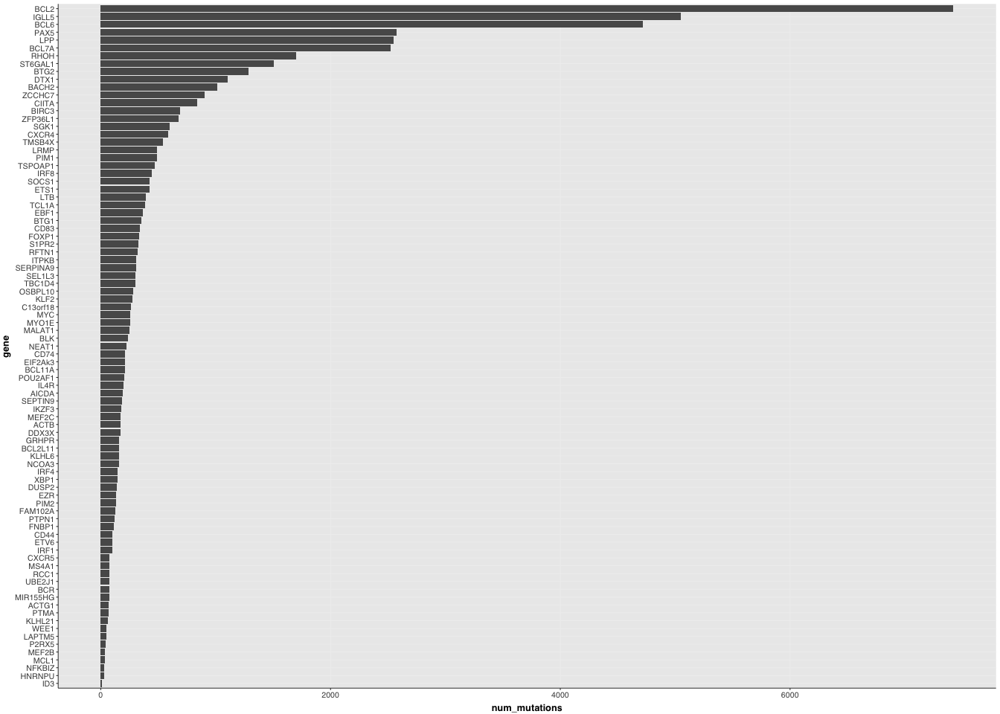

As you can see, the total number of coding + non-coding mutations
affecting each of these genes among these samples is quite variable.
BCL2, IGLL5, BCL6, PAX5 etc are the most heavily affected.

## Building a MAF summary from scratch

Many analyses will probably focus on mutations in protein-coding space
and their predicted effect on proteins. For the rest of this tutorial,
we’ll delve into this with the mutations we obtained at the start using
`get_coding_ssm`. Here, we’ll work towards reproducing the output of
[`maftools::plotmafSummary`](https://rdrr.io/pkg/maftools/man/plotmafSummary.html),
working on one panel at a time.

``` r
make_panel1 = function(maf_data,base_size=7,title=""){
vc_counted  = maf_data %>% 
  group_by(Variant_Classification) %>% 
  count() %>% 
  arrange(n)
vc_counted$Variant_Classification = factor(
        vc_counted$Variant_Classification,
        levels=unique(vc_counted$Variant_Classification)
    )
mut_cols = get_gambl_colours("mutation")
p1 = ggplot(vc_counted,
            aes(x=n,
                y=Variant_Classification,
                fill=Variant_Classification)) + 
  geom_col() + scale_fill_manual(values=mut_cols)+
  theme_Morons(base_size = base_size,
  my_legend_position = "none")  +
  theme(axis.title.x = element_blank(),
        axis.title.y = element_blank(),
    axis.text.x=element_blank(),
        axis.ticks.x=element_blank(),
        panel.grid.major = element_blank(),
        panel.grid.minor = element_blank()
        ) +
  ggtitle(title)
p1
}
make_panel1(genome_coding, title="Genomes, coding regions")
```

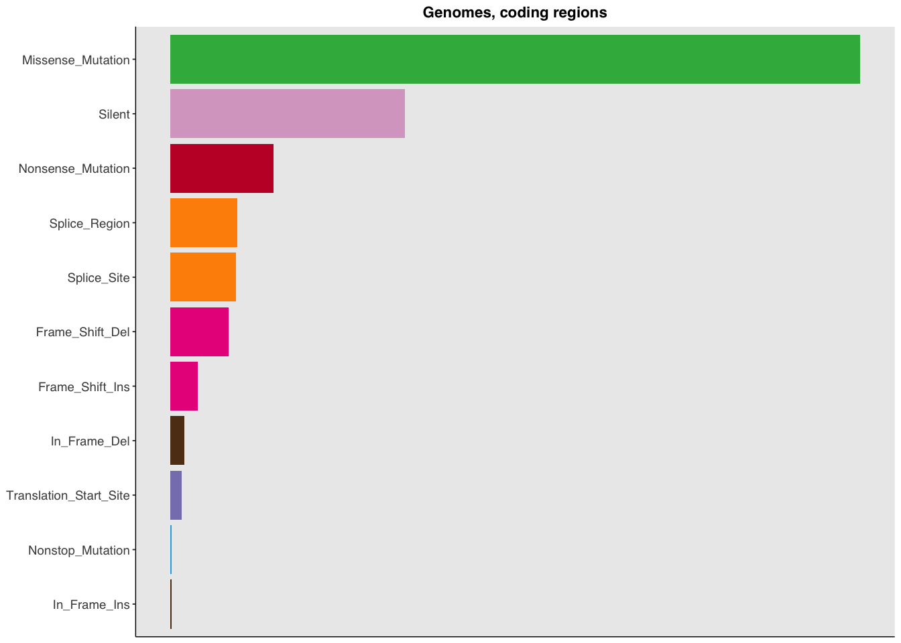

``` r
make_panel1(genome_all, title="Genomes, all regions")
```

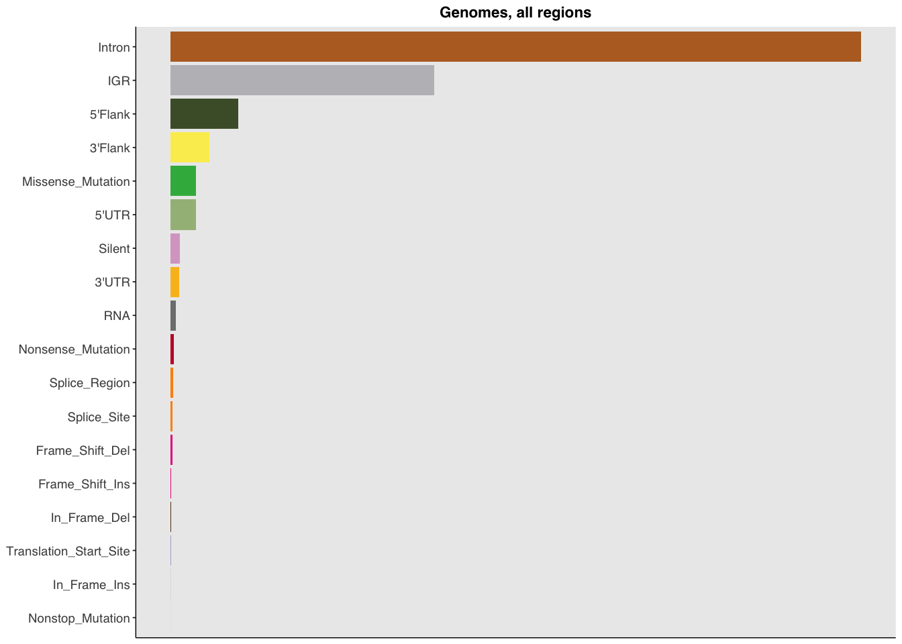

``` r
make_panel1(capture_coding, title="Exomes")
```

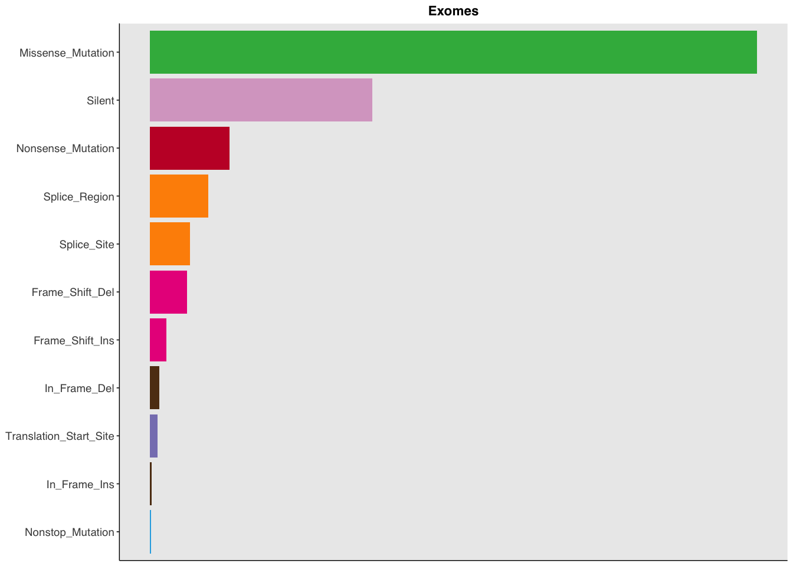

``` r
make_panel2 = function(maf_data,base_size=7,title=""){
type_counted  = maf_data %>% 
  group_by(Variant_Type) %>% 
  count() %>% 
  arrange(n)
type_counted$Variant_Type = factor(
        type_counted$Variant_Type,
        levels=unique(type_counted$Variant_Type)
    )

mut_cols = c(SNP="purple1",INS="yellow3",DEL="lightblue",DNP="orange","TNP"="lightgreen")
p2 =ggplot(type_counted,aes(x=n,y=Variant_Type,fill=Variant_Type)) + 
  geom_col() + scale_fill_manual(values=mut_cols)+
  theme_Morons(base_size = base_size,my_legend_position = "none")  +
  theme(axis.title.x = element_blank(),
        axis.title.y = element_blank(),
    axis.text.x=element_blank(),
        axis.ticks.x=element_blank(),
        panel.grid.major = element_blank(),
        panel.grid.minor = element_blank()
        ) +
  ggtitle(title)
  p2
}
make_panel2(genome_coding, title="Genomes, coding regions")
```

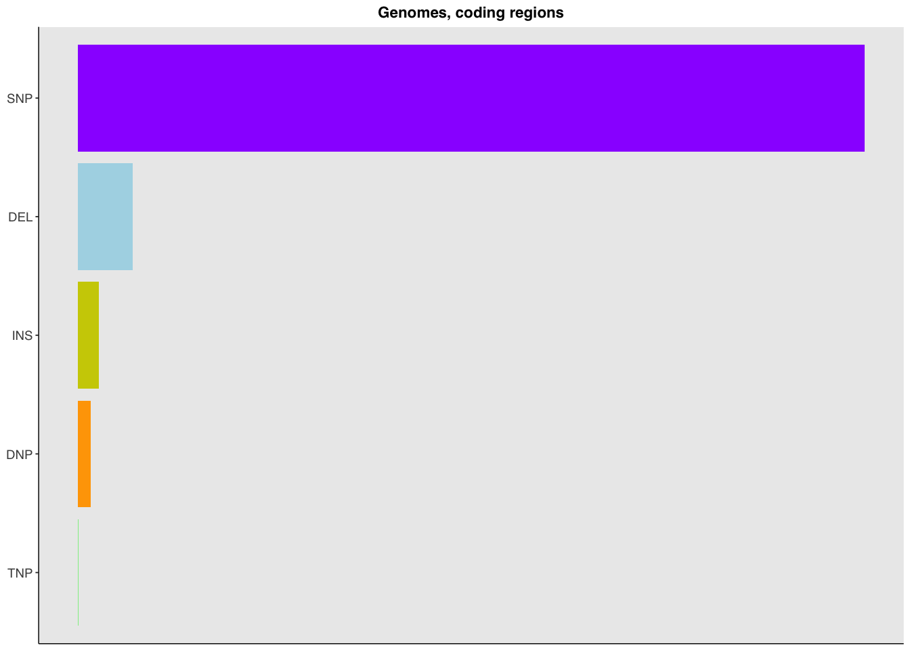

``` r
make_panel2(genome_all, title="Genomes, all regions")
```

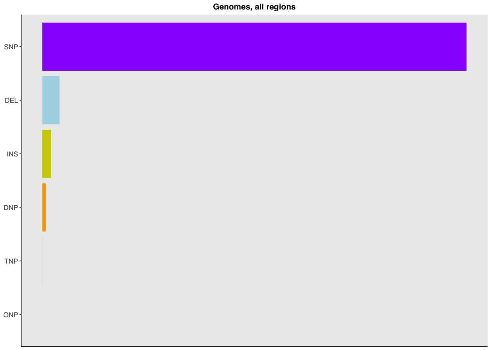

``` r
make_panel2(capture_coding, title = "Exomes")
```

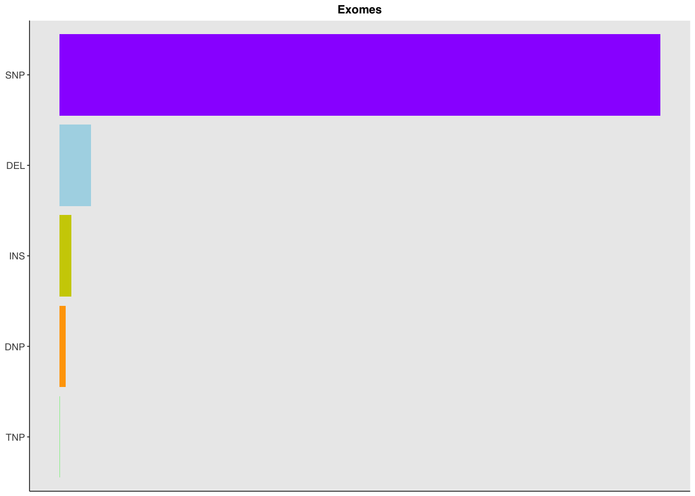

``` r
make_panel3 = function(maf_data,base_size=7,title=""){
  

comp = function(base){
  chartr("ACTG", "TGAC",base)
}
maf_data = mutate(maf_data,
                       class = case_when(
                         Reference_Allele %in% c("T","C") ~ 
                           paste0(Reference_Allele,
                                  ">",
                                  Tumor_Seq_Allele2),
                         TRUE ~ paste0(comp(Reference_Allele),
                                       ">",
                                       comp(Tumor_Seq_Allele2)))
                       )

class_counted = maf_data %>% dplyr::filter(Variant_Type == "SNP") %>%
  group_by(class) %>% count()
class_counted = mutate(class_counted,class = factor(class,levels=c("C>A","C>G","C>T","T>C","T>A","T>G")))
mut_cols = get_gambl_colours("rainfall")
p3 = ggplot(class_counted,aes(x=n,y=class,fill=class)) + 
  geom_col() + scale_fill_manual(values=mut_cols)+
  theme_Morons(base_size = base_size,my_legend_position = "none")  + 
  theme(axis.title.x = element_blank(),
        axis.title.y = element_blank(),
    axis.text.x=element_blank(),
        axis.ticks.x=element_blank(),
        panel.grid.major = element_blank(),
        panel.grid.minor = element_blank()
        ) +
  ggtitle(title)
p3
}
make_panel3(genome_coding, title="Genomes, coding regions")
```

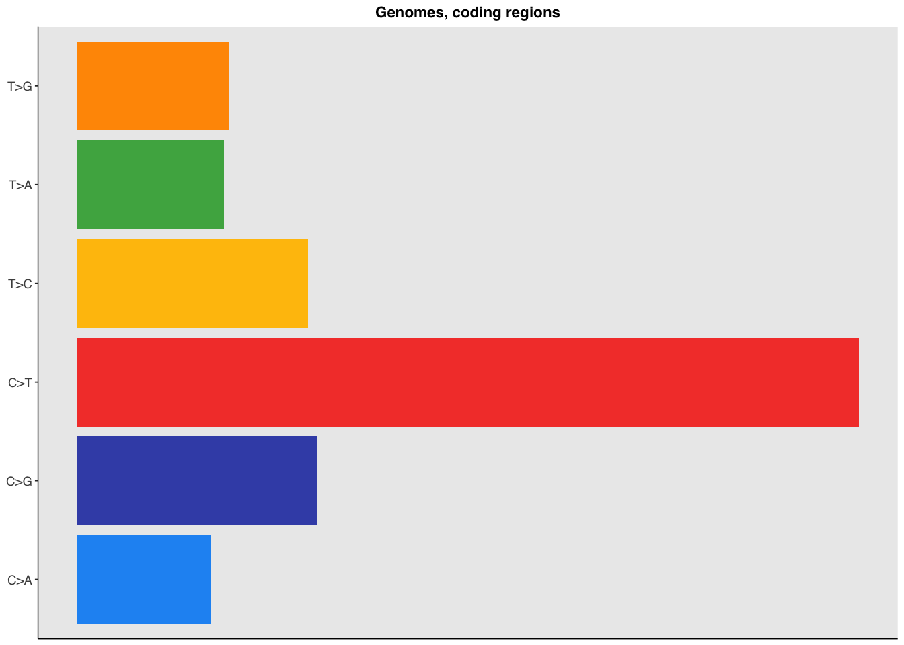

``` r
make_panel3(genome_all, title="Genomes, all regions")
```

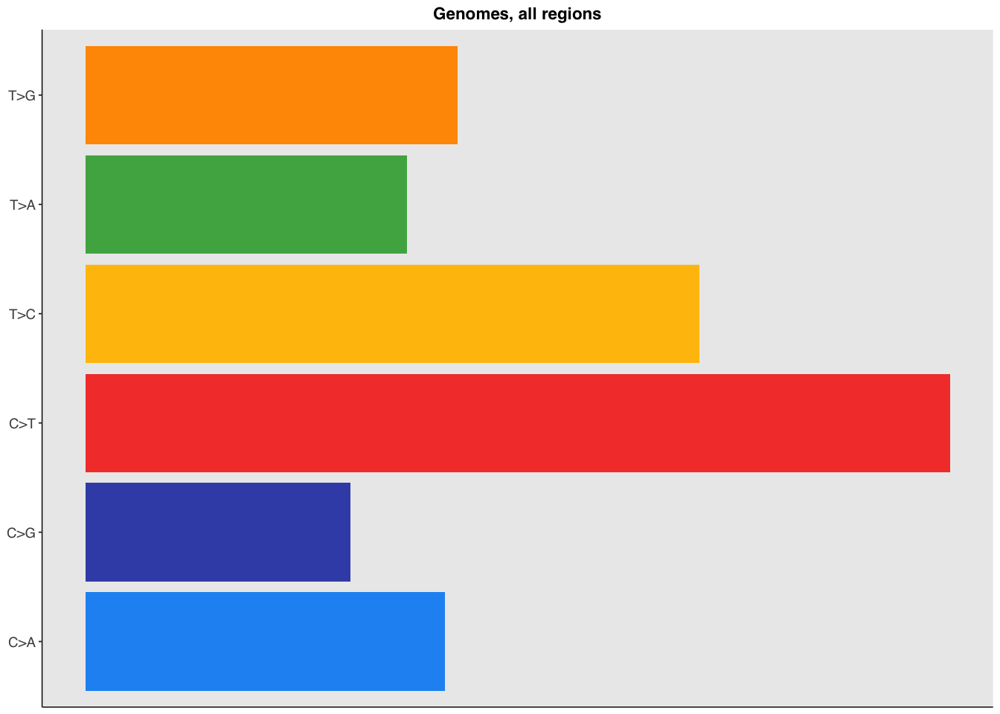

``` r
make_panel3(capture_coding, title = "Exomes")
```

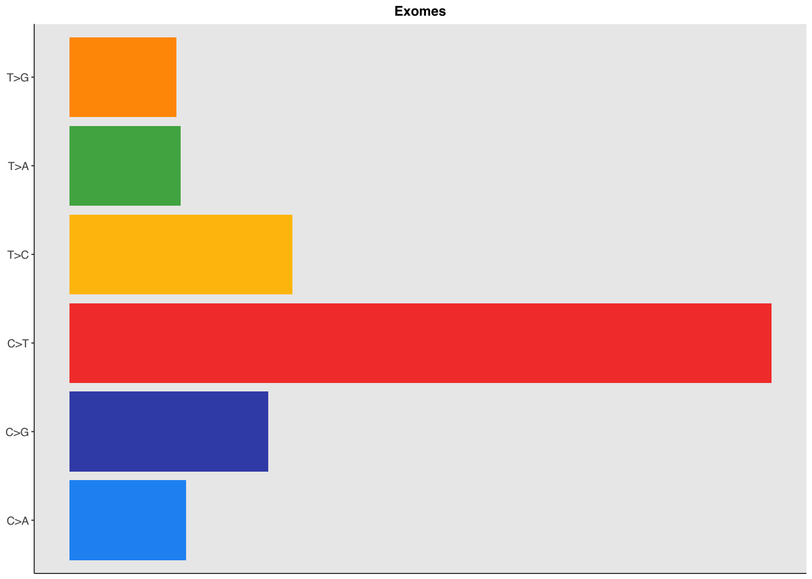

``` r
make_panel4 = function(maf_data,base_size=7,title=""){
  

type_counted  = maf_data %>% 
  group_by(Tumor_Sample_Barcode,Variant_Classification) %>% 
  count() %>% 
  arrange(desc(n))
type_counted$Tumor_Sample_Barcode = factor(type_counted$Tumor_Sample_Barcode,
                                            levels=unique(type_counted$Tumor_Sample_Barcode))

mut_cols = get_gambl_colours("mutation")
p4 = ggplot(type_counted,aes(x=Tumor_Sample_Barcode,y=n,fill=Variant_Classification)) + 
  geom_col() +
  scale_fill_manual(values=mut_cols) +
  
  theme_Morons(base_size = base_size,my_legend_position = "none") + 
  theme(axis.title.x = element_blank(),
        axis.title.y = element_blank(),
    axis.text.x=element_blank(),
        axis.ticks.x=element_blank(),
        panel.grid.major = element_blank(),
        panel.grid.minor = element_blank()
        ) +
  ggtitle(title)
  

p4
}
make_panel4(genome_coding, title="Genomes, coding regions")
```

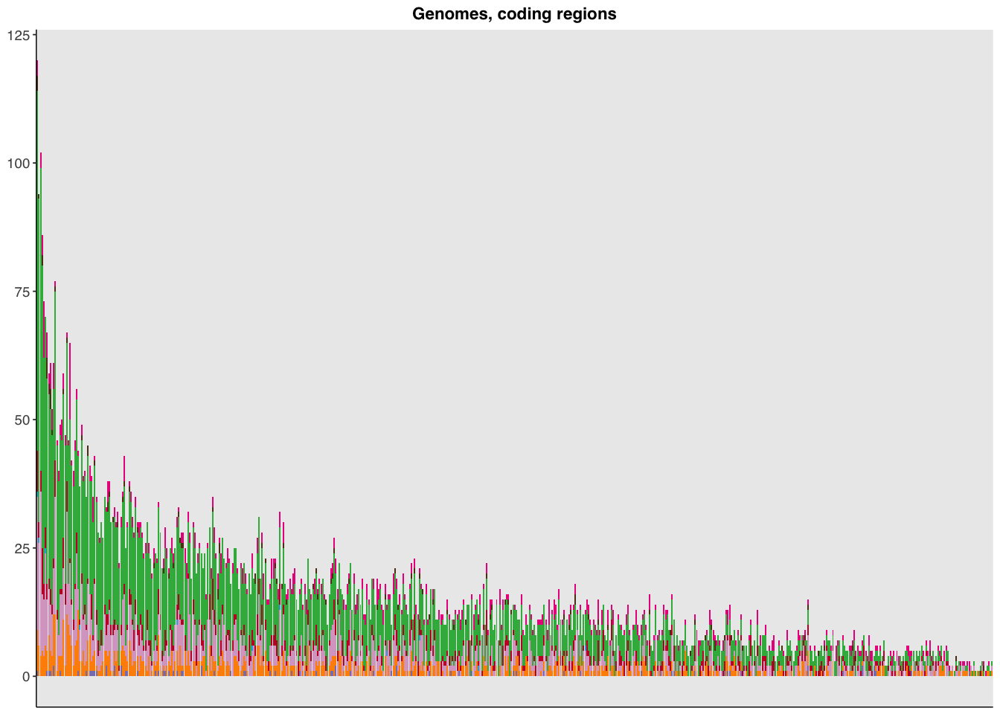

``` r
make_panel4(genome_all, title="Genomes, all regions")
```

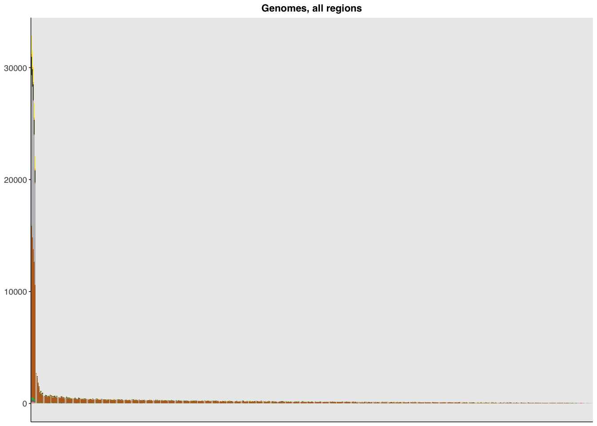

``` r
make_panel4(capture_coding, title = "Exomes")
```

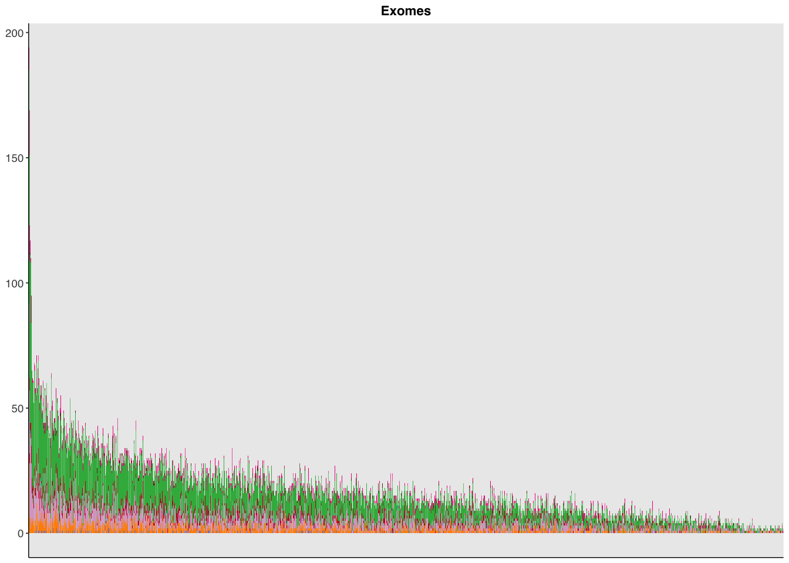

``` r
library(ggbeeswarm)
make_panel5 = function(maf_data,base_size=7,point_size=0.5,title=""){
  mut_cols = get_gambl_colours()
  type_counted  = maf_data %>% 
  group_by(Tumor_Sample_Barcode,Variant_Classification) %>% 
  count() %>% 
  arrange(desc(n))
vc_counted  = maf_data %>% 
  group_by(Variant_Classification) %>% 
  count() %>% 
  arrange(n)
vc_counted$Variant_Classification = factor(vc_counted$Variant_Classification,
                                             levels=unique(vc_counted$Variant_Classification))
type_counted$Variant_Classification = factor(type_counted$Variant_Classification,
                                             levels=rev(unique(vc_counted$Variant_Classification)))
p5 = ggplot(type_counted,aes(x=Variant_Classification,y=n,colour=Variant_Classification)) + 
  geom_quasirandom(size=point_size) +
  scale_colour_manual(values=mut_cols) +
  scale_y_log10() +
  theme_Morons(base_size = base_size,my_legend_position = "none")  +
  theme(axis.title.y =element_blank(),
        axis.text.x =element_blank(),
        axis.title.x = element_blank(),
        axis.ticks.x=element_blank()) +
  ggtitle(title)
p5
}
make_panel5(genome_coding, title="Genomes, coding regions")
```

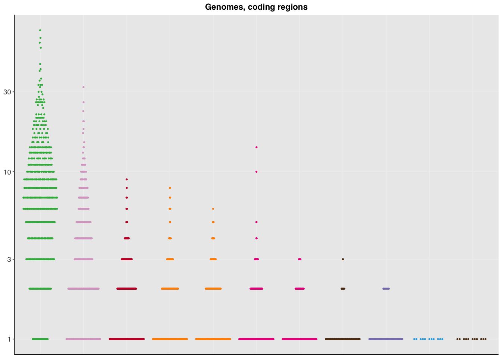

``` r
make_panel5(genome_all, title="Genomes, all regions")
```

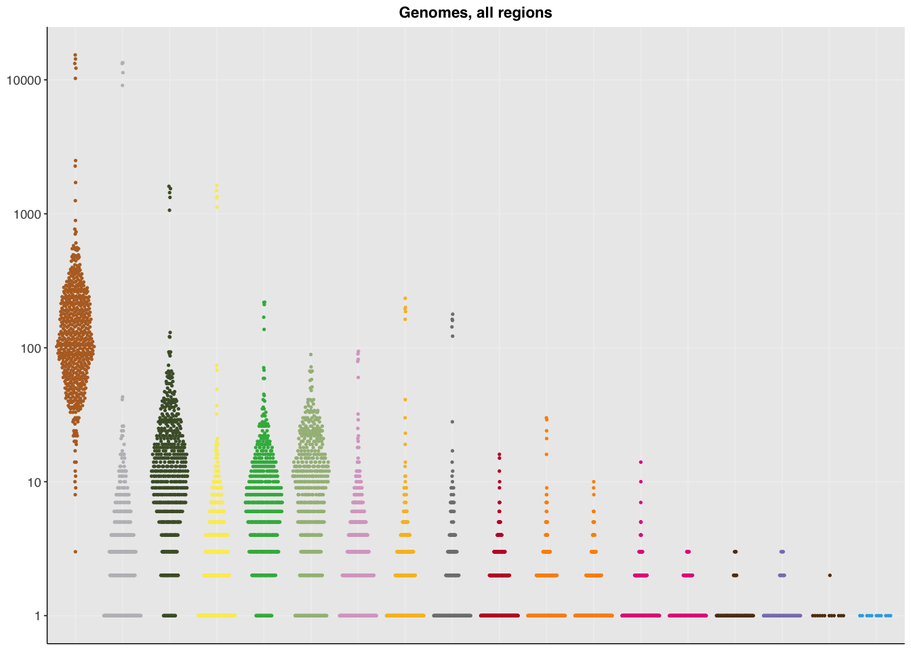

``` r
make_panel5(capture_coding, title="Exomes")
```

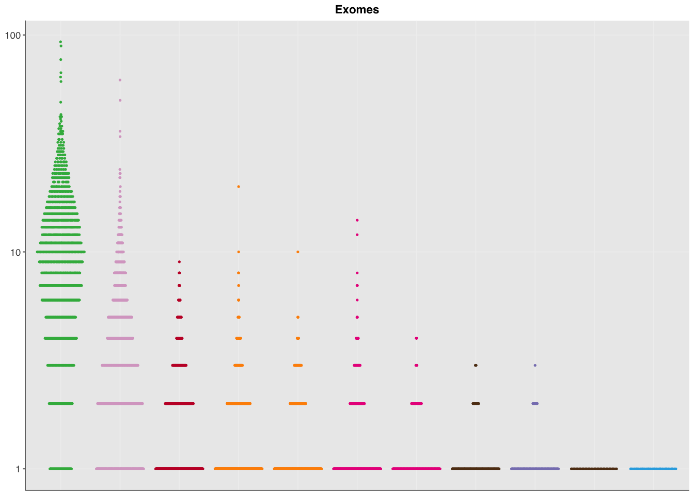

``` r
make_panel6 = function(maf_data,base_size=7,top=10,title=""){
  type_counted  = maf_data %>% 
  group_by(Hugo_Symbol,Variant_Classification) %>% 
  count() %>% 
  arrange(n)

top_n = group_by(type_counted,Hugo_Symbol) %>%
  summarise(total=sum(n)) %>%
  arrange(desc(total)) %>%
  slice_head(n=top) %>%
  pull(Hugo_Symbol)
mut_cols = get_gambl_colours()
some_type_counted = dplyr::filter(type_counted,Hugo_Symbol %in% top_n)
some_type_counted$Hugo_Symbol = factor(some_type_counted$Hugo_Symbol,
                                            levels=rev(top_n))
p6 = 
  ggplot(some_type_counted,aes(y=Hugo_Symbol,x=n,fill=Variant_Classification)) + 
  geom_col() +
  scale_fill_manual(values=mut_cols) +
  theme_Morons(base_size = base_size,my_legend_position = "none")  +
  theme(axis.text.x=element_blank(),
        axis.title.y = element_blank(),
        axis.title.x = element_blank(),
        axis.ticks.x=element_blank()) +
  ggtitle(title)

p6
}
make_panel6(genome_coding,base_size=6, title="Genome, coding regions")
```

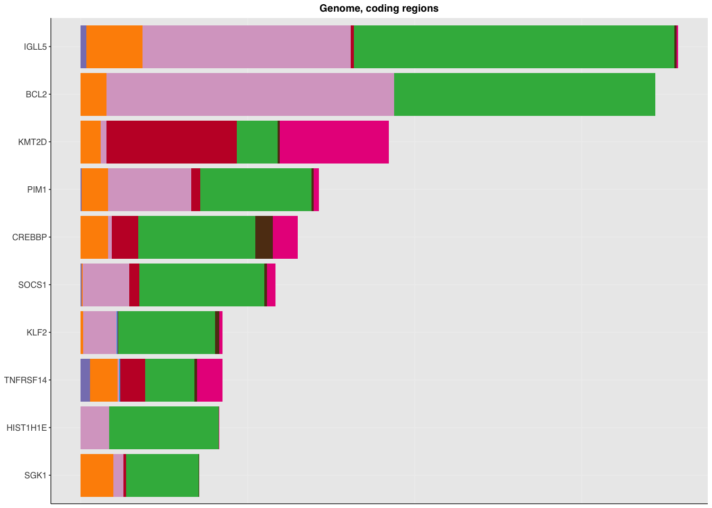

``` r
make_panel6(genome_all, title="Genomes, all regions")
```

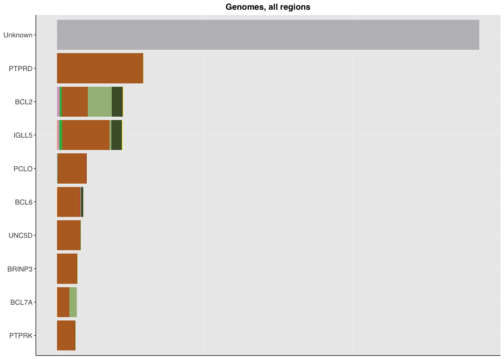

``` r
make_panel6(capture_coding, title = "Exomes")
```

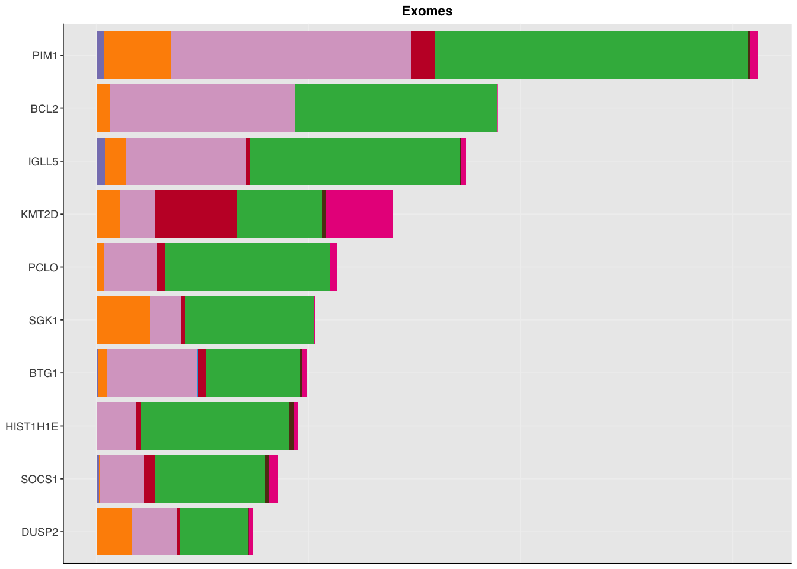

``` r
library(cowplot)
bs = 8
ps =0.1
p1 = make_panel1(genome_coding,base_size = bs,title="Variant Classification")
p2 = make_panel2(genome_coding,base_size = bs,title="Variant Type")
p3 = make_panel3(genome_coding,base_size = bs,title="SNV Class")
p4 = make_panel4(genome_coding,base_size = bs,title="Variants per sample")
p5 = make_panel5(genome_coding,base_size = bs,point_size=ps,title="Variant Classification Summary")
p6 = make_panel6(genome_coding,base_size = bs, title="Top 10 genes")
all_p = cowplot::plot_grid(p1,p2,p3,p4,p5,p6,nrow = 2,ncol=3)
all_p
```

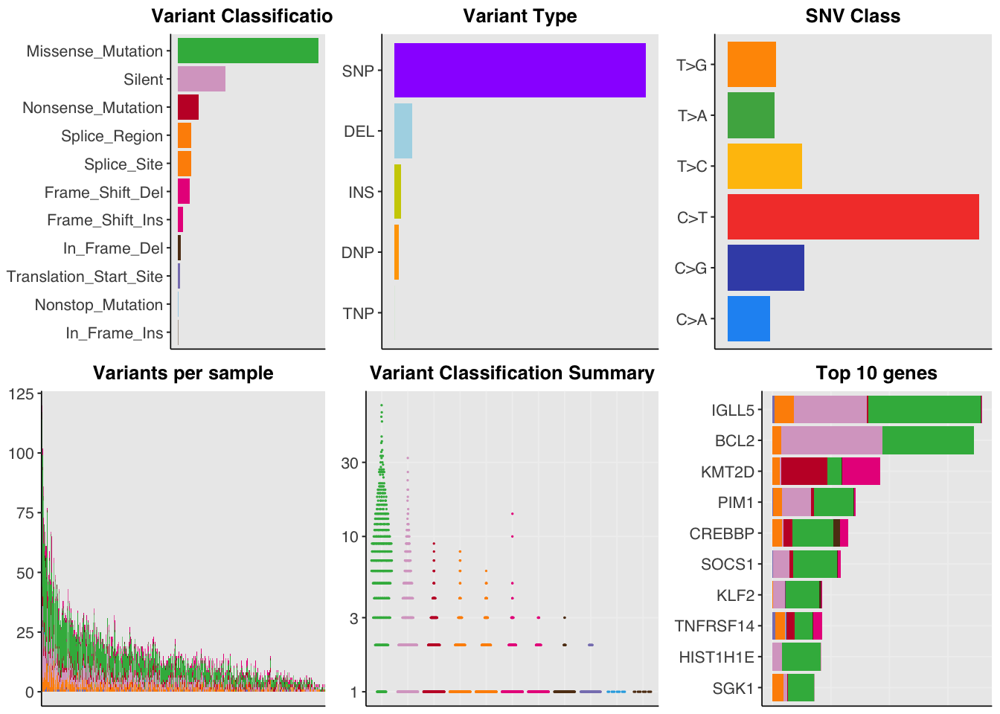

*Happy GAMBLing!*

      /$$$$$$     /$$$$$$    /$$      /$$   /$$$$$$$    /$$        .:::::::
     /$$__  $$   /$$__  $$  | $$$    /$$$  | $$__  $$  | $$        .::    .::
    | $$  \__/  | $$  \ $$  | $$$$  /$$$$  | $$  \ $$  | $$        .::    .::
    | $$ /$$$$  | $$$$$$$$  | $$ $$/$$ $$  | $$$$$$$   | $$   <-   .: .::
    | $$|_  $$  | $$__  $$  | $$  $$$| $$  | $$__  $$  | $$        .::  .::
    | $$  \ $$  | $$  | $$  | $$\  $ | $$  | $$  \ $$  | $$        .::    .::
    |  $$$$$$/  | $$  | $$  | $$ \/  | $$  | $$$$$$$/  | $$$$$$$$  .::      .::
     \______/   |__/  |__/  |__/     |__/  |_______/   |________/
     ~GENOMIC~~~~~~~~~~~~~OF~~~~~~~~~~~~~~~~~B-CELL~~~~~~~~~~~~~~~~~~IN~~~~~~
     ~~~~~~~~~~~~ANALYSIS~~~~~~MATURE~~~~~~~~~~~~~~~~~~~LYMPHOMAS~~~~~~~~~~R~ 
